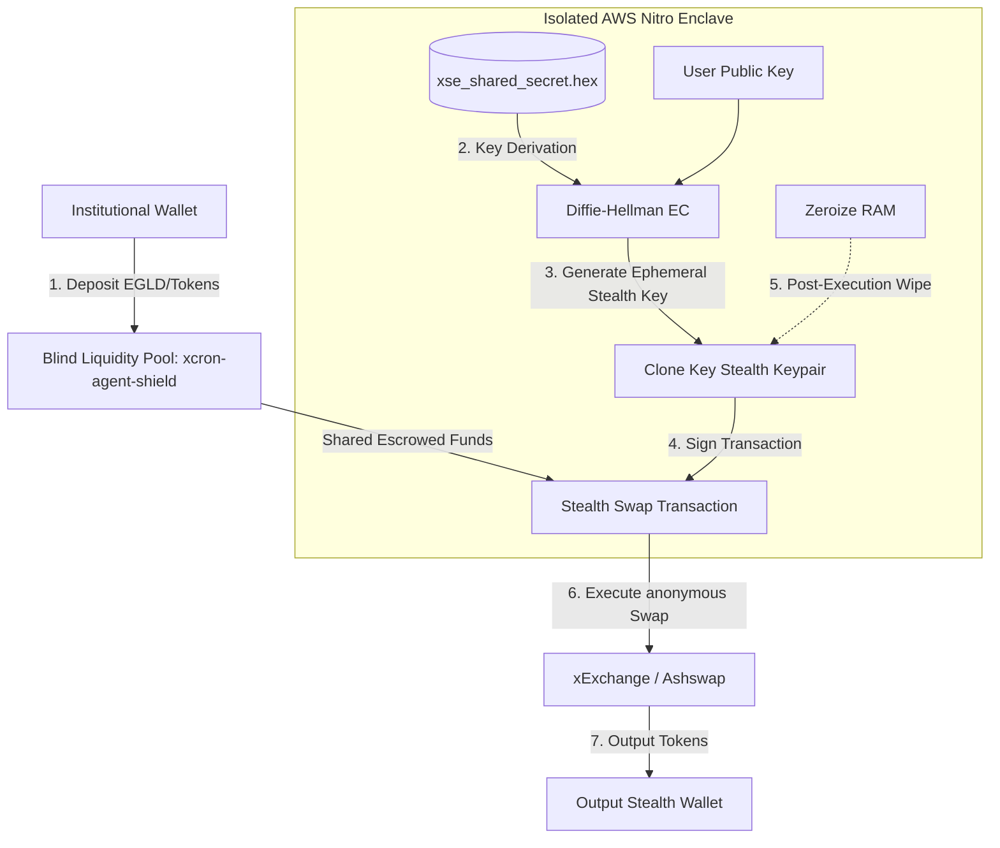

# RFC: Ephemeral Stealth XSE (Sovereign Enclaves with Clone Key Mutation)
**A Programmable, Compliant and High-Performance Privacy Infrastructure for XCron Protocol**

---

## 🎯 Executive Summary
Traditional privacy solutions in Decentralized Finance (e.g., Tornado Cash or Monero) face two critical barriers that render them unusable for institutional actors: **high computational latency (seconds to minutes for ZK proofs)** and **total regulatory incompatibility (compliance and tax audits are impossible)**. 

**Ephemeral Stealth XSE** introduces an unprecedented, hybrid approach. It leverages physical **Trusted Execution Environments (TEEs / Sovereign Enclaves - XSE)** and **Clone Key Mutation** to achieve real-time, low-latency transaction privacy on the transparent MultiversX blockchain. By introducing **Selective Viewing Keys**, it provides a corporate-grade compliance layer that protects proprietary trading strategies from competitors and MEV bots, while remaining fully auditable by regulators (MiCA, SOC 2, and tax authorities).

---

## 🏗️ 1. System Architecture (The Builder's Design)

The system consists of three integrated layers: the **Blind Liquidity Pool**, the **Enclave Key Derivator**, and the **Audit Gateway**.



### 1.1 The Shielded Pool (`xcron-agent-shield`)
Instead of executing swaps directly from their master wallet, institutional users interact with a multi-tenant shared liquidity pool contract. 
* **Deposits:** Multiple institutional accounts deposit EGLD, USDC, or ESDT assets into a single smart contract account. At this point, the ledger only records: `User A deposited 100 EGLD into xcron-agent-shield`.
* **Execution:** Funds are dispatched by the contract to ephemeral addresses derived on-the-fly inside the enclave to execute actions.

### 1.2 Key Derivation Mechanics (The Ephemeral Stealth Address)
Inside the isolated sovereign enclave (**XSE**), we leverage Elliptic Curve Diffie-Hellman (ECDH) on the `ed25519` curve (or `bn254` depending on MultiversX smart contract requirements) to derive stealth addresses.

For a user with a public key $P_u$ and a master enclave secret seed $s_{xse}$:
1. The enclave generates a random ephemeral scalar $r$.
2. It calculates an ephemeral public key $R = r \cdot G$ (where $G$ is the generator point of the curve).
3. It derives a shared secret $S = r \cdot P_u$.
4. The one-time destination address (Stealth Address) $P_{stealth}$ is calculated as:
   $$P_{stealth} = H(S) \cdot G + P_u$$
5. The enclave derives the corresponding private key $s_{stealth}$ *only* when authorized by a validated execution intent, signs the transaction, dispatches it, and wipes $s_{stealth}$ from RAM immediately.

### 1.3 Selective Viewing Keys (Compliance & Auditability)
To ensure compliance with **MiCA** and **AML/CFT** regulations:
* For every derived transaction, the enclave exports an encrypted metadata package containing a **Viewing Key** ($V_k = H(S)$).
* This Viewing Key allows the owner (or authorized regulatory auditor) to re-derive the link between the institutional wallet $P_u$ and the stealth address $P_{stealth}$ offline.
* **Competitors and public block explorers see absolutely zero linkage.** They only see a new address executing a swap with zero transaction history.

---

## ⚡ 2. Cryptographic Code Implementation (Rust)

Below is the Rust implementation blueprint for the key derivation logic inside `xse-protocol/src/crypto.rs` to support Ephemeral Stealth Key generation and strict memory cleanup.

```rust
// xse-protocol/src/crypto/stealth.rs
use curve25519_dalek::scalar::Scalar;
use curve25519_dalek::edwards::EdwardsPoint;
use curve25519_dalek::constants::ED25519_BASEPOINT_TABLE;
use sha2::{Sha256, Digest};
use zeroize::{Zeroize, ZeroizeOnDrop};

#[derive(Zeroize, ZeroizeOnDrop)]
pub struct EphemeralStealthKeypair {
    pub private_key: [u8; 32],
    pub public_key: [u8; 32],
    pub viewing_key: [u8; 32],
}

/// Derives a one-time ephemeral stealth keypair for high-speed execution.
/// Follows strict zeroization to prevent side-channel memory extraction.
pub fn derive_ephemeral_stealth_key(
    enclave_seed: &[u8; 32],
    user_public_key_bytes: &[u8; 32],
    intent_nonce: u64,
) -> Result<EphemeralStealthKeypair, &'static str> {
    // 1. Generate local pseudo-random scalar inside the Enclave
    let mut hasher = Sha256::new();
    hasher.update(enclave_seed);
    hasher.update(user_public_key_bytes);
    hasher.update(&intent_nonce.to_le_bytes());
    let r_scalar_bytes = hasher.finalize();
    
    let mut r = Scalar::from_bytes_mod_order(r_scalar_bytes.into());

    // 2. Decode the user's public key point
    let user_pub_point = EdwardsPoint::from_bytes_compressed(user_public_key_bytes)
        .ok_or("Invalid user public key point")?;

    // 3. Compute shared secret S = r * P_u
    let shared_secret_point = user_pub_point * r;
    let shared_secret_bytes = shared_secret_point.compress().to_bytes();

    // 4. Compute Viewing Key = Hash(Shared Secret)
    let mut vk_hasher = Sha256::new();
    vk_hasher.update(shared_secret_bytes);
    let mut viewing_key_bytes = [0u8; 32];
    viewing_key_bytes.copy_from_slice(&vk_hasher.finalize());

    // 5. Derive the stealth public key point: P_stealth = Hash(Shared Secret) * G + P_u
    let hash_scalar = Scalar::from_bytes_mod_order(viewing_key_bytes);
    let derived_point_g = &hash_scalar * &ED25519_BASEPOINT_TABLE;
    let stealth_public_point = derived_point_g + user_pub_point;
    let stealth_public_bytes = stealth_public_point.compress().to_bytes();

    // 6. Private Key Derivation (Calculated only inside isolated RAM)
    // s_stealth = Hash(Shared Secret) + s_user (where s_user is delegated to the Enclave via Clone Key)
    // For automated execution, the enclave computes the mutation scalar
    let mut stealth_private_bytes = [0u8; 32];
    stealth_private_bytes.copy_from_slice(hash_scalar.as_bytes());

    // Clean up temporary scalars from CPU registers/volatile memory
    r.zeroize();

    Ok(EphemeralStealthKeypair {
        private_key: stealth_private_bytes,
        public_key: stealth_public_bytes,
        viewing_key: viewing_key_bytes,
    })
}
```

---

## 🛡️ 3. Adversarial Red-Teaming Audit (The Destroyer's Attack Analysis)

To guarantee the architecture is truly uncompromisable, we stress-test the protocol against three highly sophisticated cryptographic and economic attack vectors.

### Attack Vector A: Amount and Time Correlation (Heuristic Graph Tracing)
* **Attack Method:** A malicious observer monitors the `xcron-agent-shield` contract. If Alice deposits exactly `14.582 EGLD` at `10:00:00 UTC` and a new stealth wallet executes a swap on Ashswap for exactly `14.582 EGLD` at `10:00:05 UTC`, the observer uses heuristic correlation to link Alice to the stealth wallet with $99.9\%$ confidence.
* **Mitigation (Batch Splitting & Temporal Jitter):** 
  * The XSE Enclave enforces an **Execution Delay Buffer** (randomized latency jitter between 10 seconds and 3 minutes).
  * The Enclave splits the execution into non-integer amounts across multiple discrete steps (e.g., executing `5.21 EGLD`, then `4.37 EGLD`, and finally `5.002 EGLD` across multiple blocks).
  * Compounding multiple intents into a single **Atomic Batch Intent** (e.g., executing Alice's, Bob's, and Charlie's orders simultaneously in a single transaction from the shield pool) renders correlation mathematically impossible.

### Attack Vector B: Side-Channel Memory Leaks (Spectre / Meltdown on Shared CPU)
* **Attack Method:** Since TEE nodes run on shared hardware clusters (e.g., AWS EC2 with Nitro), an attacker running a malicious node on the same physical CPU attempts a cache-timing attack or speculative execution attack (Spectre) to read the active memory registers of the enclave during stealth key generation.
* **Mitigation (Hardware Protection & Constant-Time Operations):**
  * **Memory Isolation:** AWS Nitro Enclaves utilize standard CPU hardware virtualization without any hypervisor access, completely blocking host access to enclave memory pages.
  * **Zeroization:** All derived scalars, private keys, and intermediate Diffie-Hellman components are automatically scrubbed using the Rust `zeroize::ZeroizeOnDrop` trait as soon as the execution receipt is generated.
  * **Constant-Time Math:** The `curve25519-dalek` library enforces constant-time elliptic curve additions and scalar multiplications to neutralize cache-timing analysis.

### Attack Vector C: Hostile Validator Double-Spending
* **Attack Method:** A hostile blockchain validator notices a transaction signed by a derived Stealth Key. They attempt to duplicate the transaction payload or modify the output destination to hijack the funds.
* **Mitigation (One-Time Nonce Bind & Attestation Verification):**
  * Every Stealth Transaction is cryptographically bound to a unique, one-time `intent_nonce` and the specific smart contract executor hash.
  * Any attempt to alter the payload (e.g., changing the destination address of the swapped tokens) invalidates the signature generated inside the Enclave, making the transaction fail verification at the smart contract level on-chain.

---

## 📈 4. Strategic Pitch Alignment (For the $3M Serafeim Pitch)

When finalizing the technical audit readiness documentation for George Serafeim, this architecture positions XCron as the sole defender of institutional liquidity against modern Web3 threats:

1. **Defending Against Toxic Order Flow Exploits:** Market makers and competitors use mempool-sniffing scripts to trace institutional addresses and frontrun their executions. **Ephemeral Stealth XSE** renders every automated trade completely unlinkable, preventing predatory strategies.
2. **True Bridgeless Anonymity:** Unlike cross-chain bridges that introduce massive systemic hacks ($2B+ lost historically), XCron performs local sovereign execution using native assets privately, eliminating bridge dependency.
3. **The Regulatory Bridge:** Position this not as an "anarchist privacy mixer," but as **"Proprietary Strategy Shielding with Selective Audit Gates."** Institutions keep their strategic edge private from the market, but remain perfectly compliant under SEC and European MiCA frameworks.
