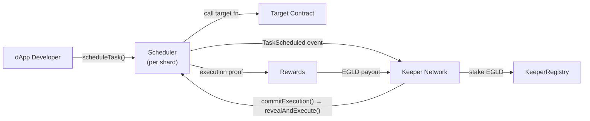

# XCron Protocol — Technical Documentation Package

> **Decentralized Task Automation for MultiversX**
> Version 0.1.0-draft | February 2026

---

## What is XCron?

**XCron** is a permissionless, decentralized protocol that enables automatic execution of smart contract functions on MultiversX — triggered by time or on-chain conditions — without centralized servers or human intervention.

It fills a critical infrastructure gap: blockchains can't "wake up" on their own. XCron provides the missing automation layer, powered by an open network of incentivized keepers.

---

## Documents

| # | Document | Description |
|---|---|---|
| 1 | [Architecture](file:///Users/alejandrochitu/.gemini/antigravity/brain/b21dfea5-5e66-4a29-9f1a-72403aab6fe7/01_architecture.md) | Component diagram, shard-aware design, task lifecycle, value flow, security overview |
| 2 | [Smart Contracts](file:///Users/alejandrochitu/.gemini/antigravity/brain/b21dfea5-5e66-4a29-9f1a-72403aab6fe7/02_smart_contracts.md) | Scheduler, KeeperRegistry, Rewards, Governance — full Rust code with `multiversx-sc` |
| 3 | [Keeper Specification](file:///Users/alejandrochitu/.gemini/antigravity/brain/b21dfea5-5e66-4a29-9f1a-72403aab6fe7/03_keeper_specification.md) | Off-chain node software: sync, monitoring, execution, gas management |
| 4 | [Tokenomics](file:///Users/alejandrochitu/.gemini/antigravity/brain/b21dfea5-5e66-4a29-9f1a-72403aab6fe7/04_tokenomics.md) | Revenue streams, keeper incentive formulas, sustainability projections |
| 5 | [Roadmap](file:///Users/alejandrochitu/.gemini/antigravity/brain/b21dfea5-5e66-4a29-9f1a-72403aab6fe7/05_roadmap.md) | 4-phase plan: MVP → Alpha → Beta → Production (18 months) |
| 6 | [Risk Analysis](file:///Users/alejandrochitu/.gemini/antigravity/brain/b21dfea5-5e66-4a29-9f1a-72403aab6fe7/06_risk_analysis.md) | Competitive landscape, SWOT, risk matrix, go-to-market strategy |

---

## Architecture at a Glance

## Key Design Decisions

| Decision | Choice | Rationale |
|---|---|---|
| **No native token** | EGLD-only | Reduces friction, avoids regulatory risk, aligns with ecosystem |
| **Per-shard Scheduler** | Deploy proxy on each shard | Co-locate execution with target contract; avoid cross-shard latency |
| **Commit-reveal execution** | Two-phase anti-MEV | Prevents keeper front-running without requiring encryption infrastructure |
| **30% gas royalties** | Built-in revenue | MultiversX-unique advantage; passive revenue scales with usage |
| **Rust for keeper client** | Shared types with SC | Zero-cost deserialization of on-chain data structures |
