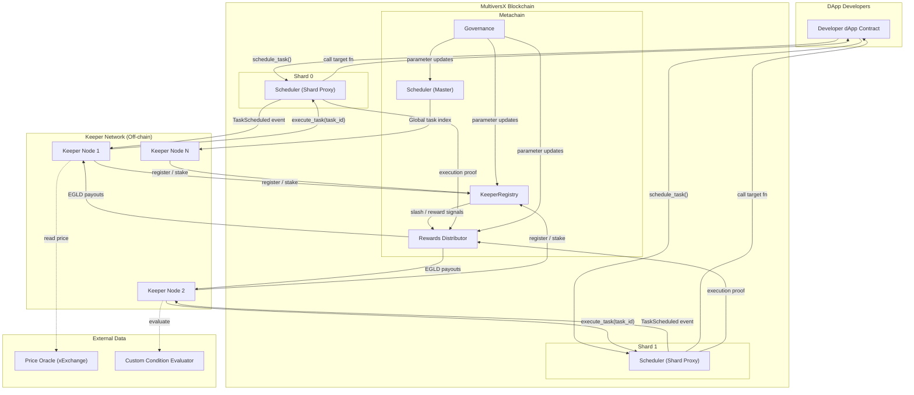
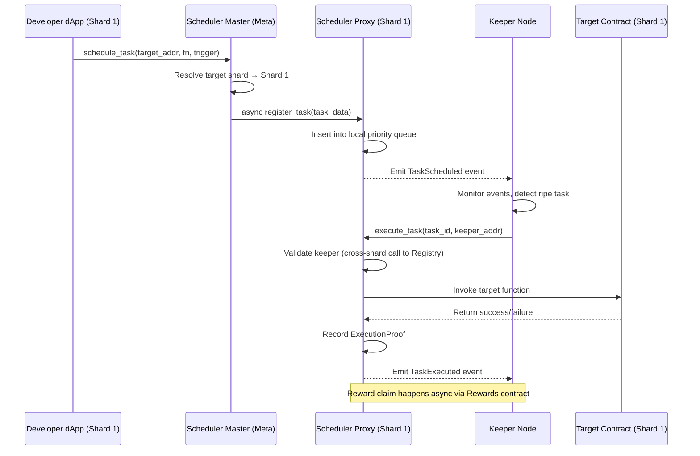
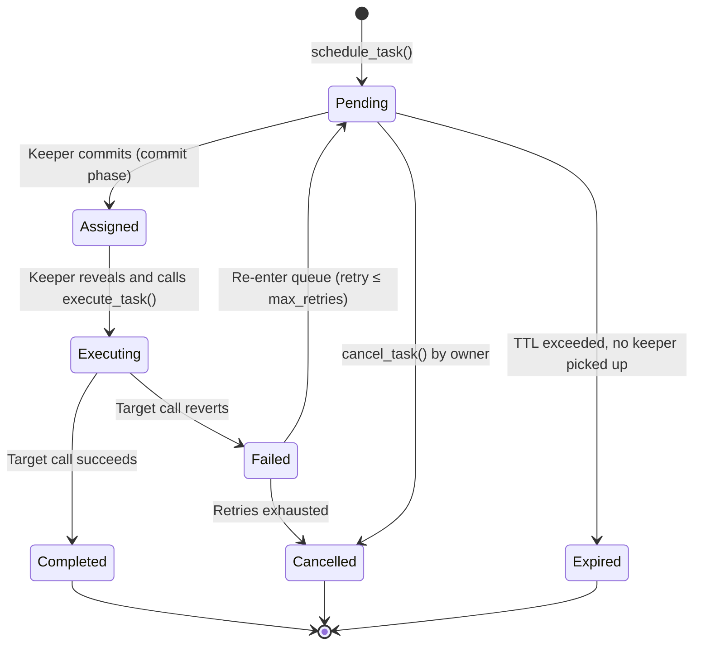
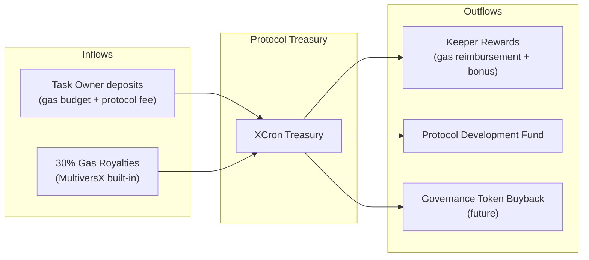

# XCron Protocol — High-Level Architecture

> **Version:** 0.1.0-draft | **Date:** 2026-02-17 | **Status:** Pre-implementation

---

## 1. Executive Summary

**XCron** is a permissionless, decentralized task-automation protocol native to the MultiversX blockchain. It enables smart contracts to schedule future function calls — triggered by time or on-chain/off-chain conditions — without relying on centralized infrastructure.

The protocol is composed of three layers:

| Layer | Role |
|---|---|
| **On-chain (Smart Contracts)** | Task registry, keeper staking, reward distribution, slashing enforcement |
| **Off-chain (Keeper Network)** | Monitors pending tasks, submits execution transactions, competes for rewards |
| **Integration (SDK / API)** | Developer-facing libraries for registering automatable functions |

---

## 2. System Component Diagram



---

## 3. Shard-Aware Architecture

MultiversX uses Adaptive State Sharding (3 execution shards + Metachain). XCron exploits this for horizontal scalability:

| Component | Deployment | Rationale |
|---|---|---|
| **Scheduler (Shard Proxy)** | One instance per execution shard (0, 1, 2) | Keeps task execution co-located with the target contract's shard, avoiding cross-shard latency for the critical `execute_task` → `target.call()` path |
| **Scheduler (Master)** | Metachain | Maintains the global task index and cross-shard task routing. Receives `schedule_task` calls for contracts whose shard is unknown to the caller |
| **KeeperRegistry** | Metachain | Single source of truth for keeper enrollment, stake balances, and reputation |
| **Rewards** | Metachain | Aggregates execution proofs from all shards and distributes payouts in batches |
| **Governance** | Metachain | Parameter voting and protocol upgrades |

### Cross-Shard Execution Flow



---

## 4. Data Flow — Task Lifecycle

A task progresses through the following states:



### Task Struct (conceptual)

```rust
pub struct Task<M: ManagedTypeApi> {
    pub id:              u64,
    pub owner:           ManagedAddress<M>,
    pub target_contract: ManagedAddress<M>,
    pub target_endpoint: ManagedBuffer<M>,
    pub target_args:     ManagedVec<M, ManagedBuffer<M>>,
    pub target_shard:    u8,
    pub trigger:         Trigger<M>,
    pub max_gas:         u64,
    pub deposit:         BigUint<M>,        // prepaid execution budget
    pub max_retries:     u8,
    pub retry_count:     u8,
    pub ttl_rounds:      u64,               // expiry in blockchain rounds
    pub created_at:      u64,               // round number
    pub status:          TaskStatus,
    pub assigned_keeper: Option<ManagedAddress<M>>,
    pub commit_hash:     Option<ManagedByteArray<M, 32>>,
}

pub enum TaskStatus {
    Pending,
    Assigned,
    Executing,
    Completed,
    Failed,
    Cancelled,
    Expired,
}

pub enum Trigger<M: ManagedTypeApi> {
    /// Execute at or after a specific round/timestamp
    TimeOnce { target_round: u64 },
    /// Execute every `interval` rounds, starting at `start_round`
    TimeRecurring { start_round: u64, interval: u64, executions_left: u64 },
    /// Execute when an on-chain condition evaluates to true
    ConditionOnChain {
        oracle_contract: ManagedAddress<M>,
        query_endpoint:  ManagedBuffer<M>,
        query_args:      ManagedVec<M, ManagedBuffer<M>>,
        comparator:      Comparator,
        threshold:       BigUint<M>,
    },
}

pub enum Comparator {
    GreaterThan,
    LessThan,
    Equal,
    GreaterOrEqual,
    LessOrEqual,
}
```

---

## 5. Value Flow



### Value Capture Breakdown (per task execution)

| Source | Recipient | Formula |
|---|---|---|
| Task owner deposit | Keeper | `actual_gas_cost × gas_price × (1 + keeper_margin)` |
| Task owner deposit | Protocol | `flat_fee + (deposit - keeper_payout) remainder` |
| Gas royalties (30% of gas fees) | Protocol treasury | Automatic via MultiversX SC developer royalties |
| Unused deposit | Task owner | Refunded on task completion or cancellation |

---

## 6. Security Architecture Overview

### Anti-Front-Running: Commit-Reveal Scheme

To prevent keeper MEV (a keeper seeing a profitable task and front-running the target contract), XCron uses a **two-phase commit-reveal** for condition-based tasks:

1. **Commit Phase** — Keeper submits `H(task_id || keeper_addr || nonce || salt)` to claim right-of-execution.
2. **Reveal Phase** — Within a `REVEAL_WINDOW` (e.g., 5 rounds), keeper submits the preimage and calls `execute_task`.
3. If reveal is valid and within window → execution proceeds.
4. If reveal is late or invalid → keeper's commit is voided, task returns to `Pending`, keeper loses a small commit-bond.

### Keeper Fault Tolerance

| Failure Mode | Detection | Response |
|---|---|---|
| Keeper commits but doesn't reveal | `REVEAL_WINDOW` expires | Task re-queued; keeper loses commit-bond |
| Keeper executes but target reverts | On-chain revert status | Task retried (up to `max_retries`); keeper still paid gas cost |
| Keeper submits wrong arguments | Argument hash mismatch | Slashing of keeper stake; task re-queued |
| No keeper picks up task | `ttl_rounds` expires | Task marked `Expired`; deposit refunded to owner |
| Keeper collusion (multiple keepers) | Statistical analysis + governance | Governance can flag and slash via vote |

---

## 7. Integration Points

| Integration | Interface | Purpose |
|---|---|---|
| **xExchange** | View functions (`getAmountOut`, `getReserve`) | Price oracle for condition-based tasks |
| **Hatom Protocol** | View functions (interest rates, positions) | Liquidation automation triggers |
| **AshSwap** | View functions (pool state) | Arbitrage condition monitoring |
| **MultiversX API/Gateway** | REST + WebSocket | Keeper node synchronization |
| **XCron SDK (TypeScript)** | NPM package | Developer task registration |
| **XCron SDK (Rust)** | Cargo crate | Smart-contract-level task registration |
