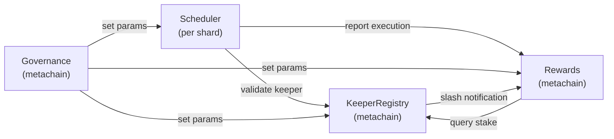

# XCron Protocol — Smart Contract Design

> **Version:** 0.1.0-draft | **Date:** 2026-02-17 | **Status:** Pre-implementation
> **Framework:** `multiversx-sc` 0.50+ | **Language:** Rust

---

## 1. Contract Map



---

## 2. Scheduler Contract

The core contract managing task registration, queueing, and execution dispatch.

### 2.1 Storage Layout

```rust
#[multiversx_sc::contract]
pub trait SchedulerContract:
    ContractBase
    + storage::SchedulerStorage
    + events::SchedulerEvents
{
}

#[multiversx_sc::module]
pub trait SchedulerStorage {
    // ── Global counters ──────────────────────────────────────
    #[storage_mapper("taskNonce")]
    fn task_nonce(&self) -> SingleValueMapper<u64>;

    // ── Task store ───────────────────────────────────────────
    #[storage_mapper("tasks")]
    fn tasks(&self, task_id: u64) -> SingleValueMapper<Task<Self::Api>>;

    // ── Time-based index: round → Vec<task_id> ───────────────
    #[storage_mapper("roundIndex")]
    fn round_index(&self, round: u64) -> UnorderedSetMapper<u64>;

    // ── Condition-based pending set ──────────────────────────
    #[storage_mapper("conditionTasks")]
    fn condition_tasks(&self) -> UnorderedSetMapper<u64>;

    // ── Owner → tasks mapping ────────────────────────────────
    #[storage_mapper("ownerTasks")]
    fn owner_tasks(&self, owner: &ManagedAddress) -> UnorderedSetMapper<u64>;

    // ── Commit-reveal store ──────────────────────────────────
    #[storage_mapper("commits")]
    fn commits(&self, task_id: u64) -> SingleValueMapper<CommitInfo<Self::Api>>;

    // ── Protocol parameters (set via governance) ─────────────
    #[storage_mapper("keeperRegistryAddr")]
    fn keeper_registry_addr(&self) -> SingleValueMapper<ManagedAddress>;

    #[storage_mapper("rewardsAddr")]
    fn rewards_addr(&self) -> SingleValueMapper<ManagedAddress>;

    #[storage_mapper("minDeposit")]
    fn min_deposit(&self) -> SingleValueMapper<BigUint>;

    #[storage_mapper("protocolFeeBps")]
    fn protocol_fee_bps(&self) -> SingleValueMapper<u64>; // basis points (e.g. 1500 = 15%)

    #[storage_mapper("revealWindow")]
    fn reveal_window(&self) -> SingleValueMapper<u64>; // rounds

    #[storage_mapper("commitBond")]
    fn commit_bond(&self) -> SingleValueMapper<BigUint>;
}
```

### 2.2 Data Structures

```rust
use multiversx_sc::derive_imports::*;

#[derive(TopEncode, TopDecode, NestedEncode, NestedDecode, TypeAbi, ManagedVecItem, Clone)]
pub struct Task<M: ManagedTypeApi> {
    pub id:              u64,
    pub owner:           ManagedAddress<M>,
    pub target_contract: ManagedAddress<M>,
    pub target_endpoint: ManagedBuffer<M>,
    pub target_args:     ManagedVec<M, ManagedBuffer<M>>,
    pub trigger:         Trigger<M>,
    pub max_gas:         u64,
    pub deposit:         BigUint<M>,
    pub max_retries:     u8,
    pub retry_count:     u8,
    pub ttl_rounds:      u64,
    pub created_round:   u64,
    pub status:          TaskStatus,
    pub assigned_keeper: Option<ManagedAddress<M>>,
}

#[derive(TopEncode, TopDecode, NestedEncode, NestedDecode, TypeAbi, Clone, PartialEq)]
pub enum TaskStatus {
    Pending,
    Committed,    // keeper committed, awaiting reveal
    Executing,
    Completed,
    Failed,
    Cancelled,
    Expired,
}

#[derive(TopEncode, TopDecode, NestedEncode, NestedDecode, TypeAbi, Clone)]
pub enum Trigger<M: ManagedTypeApi> {
    TimeOnce {
        target_round: u64,
    },
    TimeRecurring {
        start_round:     u64,
        interval:        u64,
        remaining_execs: u64,
    },
    ConditionOnChain {
        oracle_contract: ManagedAddress<M>,
        query_endpoint:  ManagedBuffer<M>,
        query_args:      ManagedVec<M, ManagedBuffer<M>>,
        comparator:      Comparator,
        threshold:       BigUint<M>,
    },
}

#[derive(TopEncode, TopDecode, NestedEncode, NestedDecode, TypeAbi, Clone, PartialEq)]
pub enum Comparator {
    Gt,
    Lt,
    Eq,
    Gte,
    Lte,
}

#[derive(TopEncode, TopDecode, NestedEncode, NestedDecode, TypeAbi, Clone)]
pub struct CommitInfo<M: ManagedTypeApi> {
    pub keeper:       ManagedAddress<M>,
    pub commit_hash:  ManagedByteArray<M, 32>,
    pub commit_round: u64,
    pub bond:         BigUint<M>,
}
```

### 2.3 Core Endpoints

```rust
#[multiversx_sc::contract]
pub trait SchedulerContract:
    ContractBase
    + storage::SchedulerStorage
    + events::SchedulerEvents
{
    #[init]
    fn init(
        &self,
        keeper_registry: ManagedAddress,
        rewards_addr:    ManagedAddress,
        min_deposit:     BigUint,
        protocol_fee_bps: u64,
        reveal_window:   u64,
        commit_bond:     BigUint,
    ) {
        self.keeper_registry_addr().set(&keeper_registry);
        self.rewards_addr().set(&rewards_addr);
        self.min_deposit().set(&min_deposit);
        self.protocol_fee_bps().set(protocol_fee_bps);
        self.reveal_window().set(reveal_window);
        self.commit_bond().set(&commit_bond);
        self.task_nonce().set(0u64);
    }

    // ═══════════════════════════════════════════════════════
    //  TASK SCHEDULING
    // ═══════════════════════════════════════════════════════

    /// Called by dApp developers or end users.
    /// Payment: EGLD deposit covering gas budget + protocol fee.
    #[payable("EGLD")]
    #[endpoint(scheduleTask)]
    fn schedule_task(
        &self,
        target_contract: ManagedAddress,
        target_endpoint: ManagedBuffer,
        target_args:     ManagedVec<ManagedBuffer>,
        trigger:         Trigger<Self::Api>,
        max_gas:         u64,
        max_retries:     u8,
        ttl_rounds:      u64,
    ) -> u64 {
        let deposit = self.call_value().egld_value().clone_value();
        require!(deposit >= self.min_deposit().get(), "Deposit below minimum");
        require!(max_gas >= 5_000_000, "max_gas too low");
        require!(ttl_rounds >= 10, "TTL too short");

        let task_id = self.task_nonce().get() + 1;
        self.task_nonce().set(task_id);

        let current_round = self.blockchain().get_block_round();

        let task = Task {
            id: task_id,
            owner: self.blockchain().get_caller(),
            target_contract,
            target_endpoint,
            target_args,
            trigger: trigger.clone(),
            max_gas,
            deposit,
            max_retries,
            retry_count: 0,
            ttl_rounds,
            created_round: current_round,
            status: TaskStatus::Pending,
            assigned_keeper: None,
        };

        self.tasks(task_id).set(&task);
        self.owner_tasks(&task.owner).insert(task_id);

        // Index the task for discovery
        match &trigger {
            Trigger::TimeOnce { target_round } => {
                self.round_index(*target_round).insert(task_id);
            },
            Trigger::TimeRecurring { start_round, .. } => {
                self.round_index(*start_round).insert(task_id);
            },
            Trigger::ConditionOnChain { .. } => {
                self.condition_tasks().insert(task_id);
            },
        }

        self.task_scheduled_event(task_id, &task.owner, &task.target_contract, current_round);
        task_id
    }

    /// Owner cancels a pending task and receives deposit refund.
    #[endpoint(cancelTask)]
    fn cancel_task(&self, task_id: u64) {
        let mut task = self.tasks(task_id).get();
        let caller = self.blockchain().get_caller();
        require!(task.owner == caller, "Not task owner");
        require!(
            task.status == TaskStatus::Pending,
            "Can only cancel Pending tasks"
        );

        task.status = TaskStatus::Cancelled;
        self.tasks(task_id).set(&task);

        // Refund deposit
        self.send().direct_egld(&caller, &task.deposit);

        // Clean up indices
        self.remove_from_indices(task_id, &task);
        self.owner_tasks(&caller).swap_remove(&task_id);

        self.task_cancelled_event(task_id);
    }

    // ═══════════════════════════════════════════════════════
    //  COMMIT-REVEAL EXECUTION (Anti-Front-Running)
    // ═══════════════════════════════════════════════════════

    /// Phase 1: Keeper commits to execute a task.
    /// Payment: commit_bond in EGLD (refunded on valid reveal).
    #[payable("EGLD")]
    #[endpoint(commitExecution)]
    fn commit_execution(
        &self,
        task_id:     u64,
        commit_hash: ManagedByteArray<32>, // H(task_id || keeper_addr || salt)
    ) {
        let bond_paid = self.call_value().egld_value().clone_value();
        require!(bond_paid >= self.commit_bond().get(), "Insufficient commit bond");

        let task = self.tasks(task_id).get();
        require!(task.status == TaskStatus::Pending, "Task not Pending");

        // Verify keeper is registered (cross-shard async in production;
        // simplified here as sync for pseudocode clarity)
        let keeper = self.blockchain().get_caller();
        self.require_registered_keeper(&keeper);

        // Check task is ripe (trigger condition met)
        self.require_task_ripe(task_id, &task);

        let commit = CommitInfo {
            keeper: keeper.clone(),
            commit_hash,
            commit_round: self.blockchain().get_block_round(),
            bond: bond_paid,
        };
        self.commits(task_id).set(&commit);

        let mut task = task;
        task.status = TaskStatus::Committed;
        task.assigned_keeper = Some(keeper.clone());
        self.tasks(task_id).set(&task);

        self.commit_event(task_id, &keeper);
    }

    /// Phase 2: Keeper reveals and executes.
    #[endpoint(revealAndExecute)]
    fn reveal_and_execute(
        &self,
        task_id: u64,
        salt:    ManagedBuffer,
    ) {
        let task = self.tasks(task_id).get();
        require!(task.status == TaskStatus::Committed, "Task not Committed");

        let commit = self.commits(task_id).get();
        let caller = self.blockchain().get_caller();
        require!(commit.keeper == caller, "Not committed keeper");

        // Verify reveal window
        let current_round = self.blockchain().get_block_round();
        let reveal_deadline = commit.commit_round + self.reveal_window().get();
        require!(current_round <= reveal_deadline, "Reveal window expired");

        // Verify commit hash: H(task_id || keeper_addr || salt)
        let mut data = ManagedBuffer::new();
        data.append(&self.serialized_u64(task_id));
        data.append(&caller.as_managed_buffer());
        data.append(&salt);
        let hash = self.crypto().keccak256(&data);
        require!(
            hash.as_managed_buffer() == commit.commit_hash.as_managed_buffer(),
            "Invalid reveal"
        );

        // ── Execute the target function ──────────────────────
        let mut task = task;
        task.status = TaskStatus::Executing;
        self.tasks(task_id).set(&task);

        let gas_before = self.blockchain().get_gas_left();

        // Async call to target contract
        self.send()
            .contract_call::<()>(
                task.target_contract.clone(),
                task.target_endpoint.clone(),
            )
            .with_raw_arguments(task.target_args.into())
            .with_gas_limit(task.max_gas)
            .async_call()
            .with_callback(
                self.callbacks().execution_callback(task_id, gas_before, caller.clone()),
            )
            .call_and_exit();
    }

    #[callback]
    fn execution_callback(
        &self,
        task_id:    u64,
        gas_before: u64,
        keeper:     ManagedAddress,
        #[call_result] result: ManagedAsyncCallResult<MultiValueEncoded<ManagedBuffer>>,
    ) {
        let mut task = self.tasks(task_id).get();
        let gas_after = self.blockchain().get_gas_left();
        let gas_used = gas_before.saturating_sub(gas_after);

        match result {
            ManagedAsyncCallResult::Ok(_) => {
                task.status = TaskStatus::Completed;
                self.tasks(task_id).set(&task);
                self.remove_from_indices(task_id, &task);

                // Refund commit bond
                let commit = self.commits(task_id).get();
                self.send().direct_egld(&keeper, &commit.bond);
                self.commits(task_id).clear();

                // Calculate and send reward
                let reward = self.calculate_reward(&task, gas_used);
                self.send().direct_egld(&keeper, &reward);

                // Send protocol fee to rewards contract
                let protocol_cut = self.calculate_protocol_fee(&task);
                let rewards_addr = self.rewards_addr().get();
                self.send().direct_egld(&rewards_addr, &protocol_cut);

                // Handle recurring tasks: re-schedule next occurrence
                if let Trigger::TimeRecurring {
                    start_round,
                    interval,
                    remaining_execs,
                } = &task.trigger
                {
                    if *remaining_execs > 1 {
                        self.reschedule_recurring(task_id, *start_round, *interval, *remaining_execs - 1);
                    }
                }

                self.task_executed_event(task_id, &keeper, gas_used, true);
            }
            ManagedAsyncCallResult::Err(_) => {
                task.retry_count += 1;
                if task.retry_count >= task.max_retries {
                    task.status = TaskStatus::Failed;
                    // Refund remaining deposit minus gas cost to owner
                    let gas_cost = self.gas_cost_egld(gas_used);
                    let refund = task.deposit.clone() - &gas_cost;
                    self.send().direct_egld(&task.owner, &refund);
                    // Pay keeper for gas spent even on failure
                    self.send().direct_egld(&keeper, &gas_cost);
                } else {
                    task.status = TaskStatus::Pending;
                    task.assigned_keeper = None;
                    // Re-index for pickup
                    self.reindex_task(task_id, &task);
                    // Pay keeper for gas spent
                    let gas_cost = self.gas_cost_egld(gas_used);
                    self.send().direct_egld(&keeper, &gas_cost);
                }

                // Refund commit bond (failure is not keeper's fault)
                let commit = self.commits(task_id).get();
                self.send().direct_egld(&keeper, &commit.bond);
                self.commits(task_id).clear();

                self.tasks(task_id).set(&task);
                self.task_executed_event(task_id, &keeper, gas_used, false);
            }
        }
    }

    // ═══════════════════════════════════════════════════════
    //  TIMEOUT HANDLING
    // ═══════════════════════════════════════════════════════

    /// Anyone can call to void an expired commit and slash the commit bond.
    #[endpoint(voidExpiredCommit)]
    fn void_expired_commit(&self, task_id: u64) {
        let task = self.tasks(task_id).get();
        require!(task.status == TaskStatus::Committed, "Task not Committed");

        let commit = self.commits(task_id).get();
        let current_round = self.blockchain().get_block_round();
        let reveal_deadline = commit.commit_round + self.reveal_window().get();
        require!(current_round > reveal_deadline, "Reveal window not expired");

        // Slash commit bond → protocol treasury
        let rewards_addr = self.rewards_addr().get();
        self.send().direct_egld(&rewards_addr, &commit.bond);
        self.commits(task_id).clear();

        // Return task to Pending
        let mut task = task;
        task.status = TaskStatus::Pending;
        task.assigned_keeper = None;
        self.tasks(task_id).set(&task);

        self.commit_voided_event(task_id, &commit.keeper);
    }

    /// Mark tasks past their TTL as Expired and refund owners.
    #[endpoint(expireStaleTasks)]
    fn expire_stale_tasks(&self, task_ids: MultiValueEncoded<u64>) {
        let current_round = self.blockchain().get_block_round();
        for task_id in task_ids {
            let mut task = self.tasks(task_id).get();
            if task.status != TaskStatus::Pending {
                continue;
            }
            if current_round > task.created_round + task.ttl_rounds {
                task.status = TaskStatus::Expired;
                self.send().direct_egld(&task.owner, &task.deposit);
                self.remove_from_indices(task_id, &task);
                self.tasks(task_id).set(&task);
                self.task_expired_event(task_id);
            }
        }
    }

    // ═══════════════════════════════════════════════════════
    //  VIEW FUNCTIONS
    // ═══════════════════════════════════════════════════════

    #[view(getTask)]
    fn get_task(&self, task_id: u64) -> Task<Self::Api> {
        self.tasks(task_id).get()
    }

    #[view(getPendingTasksForRound)]
    fn get_pending_tasks_for_round(&self, round: u64) -> MultiValueEncoded<u64> {
        let mut result = MultiValueEncoded::new();
        for task_id in self.round_index(round).iter() {
            result.push(task_id);
        }
        result
    }

    #[view(getConditionTasks)]
    fn get_condition_tasks(&self) -> MultiValueEncoded<u64> {
        let mut result = MultiValueEncoded::new();
        for task_id in self.condition_tasks().iter() {
            result.push(task_id);
        }
        result
    }

    // ═══════════════════════════════════════════════════════
    //  INTERNAL HELPERS
    // ═══════════════════════════════════════════════════════

    fn calculate_reward(&self, task: &Task<Self::Api>, gas_used: u64) -> BigUint {
        let gas_cost = self.gas_cost_egld(gas_used);
        let keeper_margin_bps: u64 = 1500; // 15% margin over gas cost
        let margin = &gas_cost * keeper_margin_bps / 10_000u64;
        gas_cost + margin
    }

    fn calculate_protocol_fee(&self, task: &Task<Self::Api>) -> BigUint {
        let fee_bps = self.protocol_fee_bps().get();
        &task.deposit * fee_bps / 10_000u64
    }

    fn gas_cost_egld(&self, gas_used: u64) -> BigUint {
        // gas_price is in the denomination of the chain (1e-18 EGLD per unit)
        let gas_price = self.blockchain().get_gas_price();
        BigUint::from(gas_used) * BigUint::from(gas_price)
    }

    fn require_task_ripe(&self, task_id: u64, task: &Task<Self::Api>) {
        let current_round = self.blockchain().get_block_round();
        match &task.trigger {
            Trigger::TimeOnce { target_round } => {
                require!(current_round >= *target_round, "Task not yet ripe");
            },
            Trigger::TimeRecurring { start_round, .. } => {
                require!(current_round >= *start_round, "Task not yet ripe");
            },
            Trigger::ConditionOnChain { .. } => {
                // Condition evaluation delegated to keeper; verified post-execution
                // via oracle re-query in a dispute window (phase 2+)
            },
        }
    }

    fn require_registered_keeper(&self, keeper: &ManagedAddress) {
        // In production: cross-shard async call to KeeperRegistry.
        // For MVP (same shard / centralized keeper): checked via whitelist.
        // Placeholder: always passes in pseudocode.
    }

    fn remove_from_indices(&self, task_id: u64, task: &Task<Self::Api>) {
        match &task.trigger {
            Trigger::TimeOnce { target_round } => {
                self.round_index(*target_round).swap_remove(&task_id);
            },
            Trigger::TimeRecurring { start_round, .. } => {
                self.round_index(*start_round).swap_remove(&task_id);
            },
            Trigger::ConditionOnChain { .. } => {
                self.condition_tasks().swap_remove(&task_id);
            },
        }
    }

    fn reindex_task(&self, task_id: u64, task: &Task<Self::Api>) {
        match &task.trigger {
            Trigger::ConditionOnChain { .. } => {
                self.condition_tasks().insert(task_id);
            },
            _ => {
                // Time-based: re-index at current round + 1
                let next_round = self.blockchain().get_block_round() + 1;
                self.round_index(next_round).insert(task_id);
            }
        }
    }

    fn reschedule_recurring(
        &self,
        original_task_id: u64,
        start_round:      u64,
        interval:         u64,
        remaining_execs:  u64,
    ) {
        let task = self.tasks(original_task_id).get();
        let next_round = self.blockchain().get_block_round() + interval;
        let new_id = self.task_nonce().get() + 1;
        self.task_nonce().set(new_id);

        let new_task = Task {
            id: new_id,
            trigger: Trigger::TimeRecurring {
                start_round: next_round,
                interval,
                remaining_execs,
            },
            status: TaskStatus::Pending,
            retry_count: 0,
            assigned_keeper: None,
            created_round: self.blockchain().get_block_round(),
            ..task
        };

        self.tasks(new_id).set(&new_task);
        self.round_index(next_round).insert(new_id);
        self.owner_tasks(&new_task.owner).insert(new_id);

        self.task_scheduled_event(new_id, &new_task.owner, &new_task.target_contract, next_round);
    }

    fn serialized_u64(&self, val: u64) -> ManagedBuffer {
        let bytes = val.to_be_bytes();
        ManagedBuffer::from(&bytes[..])
    }
}
```

### 2.4 Events

```rust
#[multiversx_sc::module]
pub trait SchedulerEvents {
    #[event("taskScheduled")]
    fn task_scheduled_event(
        &self,
        #[indexed] task_id: u64,
        #[indexed] owner:   &ManagedAddress,
        #[indexed] target:  &ManagedAddress,
        round: u64,
    );

    #[event("taskCancelled")]
    fn task_cancelled_event(&self, #[indexed] task_id: u64);

    #[event("taskExpired")]
    fn task_expired_event(&self, #[indexed] task_id: u64);

    #[event("commitSubmitted")]
    fn commit_event(&self, #[indexed] task_id: u64, #[indexed] keeper: &ManagedAddress);

    #[event("commitVoided")]
    fn commit_voided_event(&self, #[indexed] task_id: u64, #[indexed] keeper: &ManagedAddress);

    #[event("taskExecuted")]
    fn task_executed_event(
        &self,
        #[indexed] task_id: u64,
        #[indexed] keeper:  &ManagedAddress,
        gas_used: u64,
        success:  bool,
    );
}
```

---

## 3. KeeperRegistry Contract

Manages keeper enrollment, EGLD stake, and slashing.

### 3.1 Data Structures

```rust
#[derive(TopEncode, TopDecode, NestedEncode, NestedDecode, TypeAbi, Clone)]
pub struct KeeperInfo<M: ManagedTypeApi> {
    pub addr:              ManagedAddress<M>,
    pub stake:             BigUint<M>,
    pub registered_round:  u64,
    pub total_executions:  u64,
    pub successful_execs:  u64,
    pub failed_execs:      u64,
    pub slashed_amount:    BigUint<M>,
    pub active:            bool,
}
```

### 3.2 Core Endpoints

```rust
#[multiversx_sc::contract]
pub trait KeeperRegistryContract: ContractBase {

    #[init]
    fn init(&self, min_stake: BigUint, slash_pct_bps: u64, cooldown_rounds: u64) {
        self.min_stake().set(&min_stake);
        self.slash_pct_bps().set(slash_pct_bps);
        self.cooldown_rounds().set(cooldown_rounds);
    }

    // ── Registration ─────────────────────────────────────────

    /// Keeper registers by staking EGLD ≥ min_stake.
    #[payable("EGLD")]
    #[endpoint(registerKeeper)]
    fn register_keeper(&self) {
        let caller = self.blockchain().get_caller();
        require!(!self.keepers(&caller).is_empty() || true, "Re-register after unstake");

        let stake = self.call_value().egld_value().clone_value();
        require!(stake >= self.min_stake().get(), "Stake below minimum");

        let info = KeeperInfo {
            addr:             caller.clone(),
            stake,
            registered_round: self.blockchain().get_block_round(),
            total_executions: 0,
            successful_execs: 0,
            failed_execs:     0,
            slashed_amount:   BigUint::zero(),
            active:           true,
        };

        self.keepers(&caller).set(&info);
        self.active_keeper_set().insert(caller.clone());
        self.keeper_registered_event(&caller);
    }

    /// Add more stake to an existing registration.
    #[payable("EGLD")]
    #[endpoint(addStake)]
    fn add_stake(&self) {
        let caller = self.blockchain().get_caller();
        let mut info = self.keepers(&caller).get();
        let additional = self.call_value().egld_value().clone_value();
        info.stake += additional;
        self.keepers(&caller).set(&info);
    }

    /// Request unstake — triggers cooldown.
    #[endpoint(requestUnstake)]
    fn request_unstake(&self) {
        let caller = self.blockchain().get_caller();
        let mut info = self.keepers(&caller).get();
        require!(info.active, "Keeper not active");
        info.active = false;
        self.keepers(&caller).set(&info);
        self.active_keeper_set().swap_remove(&caller);
        self.unstake_request_round(&caller).set(self.blockchain().get_block_round());
    }

    /// Withdraw stake after cooldown period.
    #[endpoint(withdrawStake)]
    fn withdraw_stake(&self) {
        let caller = self.blockchain().get_caller();
        let info = self.keepers(&caller).get();
        require!(!info.active, "Must request unstake first");

        let request_round = self.unstake_request_round(&caller).get();
        let current = self.blockchain().get_block_round();
        require!(
            current >= request_round + self.cooldown_rounds().get(),
            "Cooldown not elapsed"
        );

        let amount = info.stake.clone();
        self.keepers(&caller).clear();
        self.unstake_request_round(&caller).clear();
        self.send().direct_egld(&caller, &amount);
        self.keeper_unregistered_event(&caller);
    }

    // ── Slashing (called by Scheduler or Governance) ─────────

    /// Slash a keeper's stake. Only callable by authorized contracts.
    #[endpoint(slashKeeper)]
    fn slash_keeper(&self, keeper: ManagedAddress, reason: ManagedBuffer) {
        self.require_authorized_caller();
        let mut info = self.keepers(&keeper).get();
        let slash_amount = &info.stake * self.slash_pct_bps().get() / 10_000u64;
        info.stake -= &slash_amount;
        info.slashed_amount += &slash_amount;
        self.keepers(&keeper).set(&info);

        // Transfer slashed amount to protocol treasury
        let treasury = self.treasury_addr().get();
        self.send().direct_egld(&treasury, &slash_amount);

        self.keeper_slashed_event(&keeper, &slash_amount, &reason);

        // Auto-deactivate if stake falls below minimum
        if info.stake < self.min_stake().get() {
            let mut info = self.keepers(&keeper).get();
            info.active = false;
            self.keepers(&keeper).set(&info);
            self.active_keeper_set().swap_remove(&keeper);
        }
    }

    // ── Reputation Update (called by Rewards contract) ───────

    #[endpoint(recordExecution)]
    fn record_execution(&self, keeper: ManagedAddress, success: bool) {
        self.require_authorized_caller();
        let mut info = self.keepers(&keeper).get();
        info.total_executions += 1;
        if success {
            info.successful_execs += 1;
        } else {
            info.failed_execs += 1;
        }
        self.keepers(&keeper).set(&info);
    }

    // ── Views ────────────────────────────────────────────────

    #[view(isActiveKeeper)]
    fn is_active_keeper(&self, addr: &ManagedAddress) -> bool {
        if self.keepers(addr).is_empty() { return false; }
        self.keepers(addr).get().active
    }

    #[view(getKeeperInfo)]
    fn get_keeper_info(&self, addr: &ManagedAddress) -> KeeperInfo<Self::Api> {
        self.keepers(addr).get()
    }

    #[view(getActiveKeeperCount)]
    fn get_active_keeper_count(&self) -> usize {
        self.active_keeper_set().len()
    }

    // ── Storage ──────────────────────────────────────────────

    #[storage_mapper("keepers")]
    fn keepers(&self, addr: &ManagedAddress) -> SingleValueMapper<KeeperInfo<Self::Api>>;

    #[storage_mapper("activeKeeperSet")]
    fn active_keeper_set(&self) -> UnorderedSetMapper<ManagedAddress>;

    #[storage_mapper("unstakeRequestRound")]
    fn unstake_request_round(&self, addr: &ManagedAddress) -> SingleValueMapper<u64>;

    #[storage_mapper("minStake")]
    fn min_stake(&self) -> SingleValueMapper<BigUint>;

    #[storage_mapper("slashPctBps")]
    fn slash_pct_bps(&self) -> SingleValueMapper<u64>;

    #[storage_mapper("cooldownRounds")]
    fn cooldown_rounds(&self) -> SingleValueMapper<u64>;

    #[storage_mapper("treasuryAddr")]
    fn treasury_addr(&self) -> SingleValueMapper<ManagedAddress>;

    // ── Events ───────────────────────────────────────────────

    #[event("keeperRegistered")]
    fn keeper_registered_event(&self, #[indexed] keeper: &ManagedAddress);

    #[event("keeperUnregistered")]
    fn keeper_unregistered_event(&self, #[indexed] keeper: &ManagedAddress);

    #[event("keeperSlashed")]
    fn keeper_slashed_event(
        &self,
        #[indexed] keeper: &ManagedAddress,
        amount: &BigUint,
        reason: &ManagedBuffer,
    );

    fn require_authorized_caller(&self) {
        // In production: check caller is Scheduler or Governance contract.
        // Placeholder for pseudocode.
    }
}
```

---

## 4. Rewards Contract

Aggregates execution fees and distributes payouts.

```rust
#[multiversx_sc::contract]
pub trait RewardsContract: ContractBase {

    #[init]
    fn init(
        &self,
        keeper_registry: ManagedAddress,
        treasury_split_bps: u64,    // e.g. 2000 = 20% to treasury
        keeper_bonus_pool:  BigUint, // initial bonus pool seed
    ) {
        self.keeper_registry_addr().set(&keeper_registry);
        self.treasury_split_bps().set(treasury_split_bps);
        self.bonus_pool().set(&keeper_bonus_pool);
    }

    /// Called by Scheduler after successful execution.
    /// Receives EGLD = protocol fee portion.
    #[payable("EGLD")]
    #[endpoint(receiveExecutionFee)]
    fn receive_execution_fee(&self, keeper: ManagedAddress, task_id: u64) {
        self.require_scheduler_caller();

        let fee = self.call_value().egld_value().clone_value();
        let treasury_cut = &fee * self.treasury_split_bps().get() / 10_000u64;
        let keeper_bonus = &fee - &treasury_cut;

        self.treasury_balance().update(|bal| *bal += &treasury_cut);
        self.pending_rewards(&keeper).update(|bal| *bal += &keeper_bonus);

        // Update keeper stats in registry
        self.send()
            .contract_call::<()>(
                self.keeper_registry_addr().get(),
                ManagedBuffer::from("recordExecution"),
            )
            .with_raw_arguments({
                let mut args = ManagedArgBuffer::new();
                args.push_arg(&keeper);
                args.push_arg(true); // success
                args
            })
            .with_gas_limit(5_000_000)
            .execute_on_dest_context::<()>();

        self.reward_accrued_event(task_id, &keeper, &keeper_bonus);
    }

    /// Keepers claim accumulated rewards.
    #[endpoint(claimRewards)]
    fn claim_rewards(&self) {
        let caller = self.blockchain().get_caller();
        let amount = self.pending_rewards(&caller).get();
        require!(amount > BigUint::zero(), "No pending rewards");

        self.pending_rewards(&caller).clear();
        self.send().direct_egld(&caller, &amount);

        self.rewards_claimed_event(&caller, &amount);
    }

    /// Governance can withdraw treasury for protocol development.
    #[endpoint(withdrawTreasury)]
    fn withdraw_treasury(&self, to: ManagedAddress, amount: BigUint) {
        self.require_governance_caller();
        let bal = self.treasury_balance().get();
        require!(amount <= bal, "Insufficient treasury");
        self.treasury_balance().update(|b| *b -= &amount);
        self.send().direct_egld(&to, &amount);
    }

    // ── Storage ──────────────────────────────────────────────

    #[storage_mapper("keeperRegistryAddr")]
    fn keeper_registry_addr(&self) -> SingleValueMapper<ManagedAddress>;

    #[storage_mapper("treasurySplitBps")]
    fn treasury_split_bps(&self) -> SingleValueMapper<u64>;

    #[storage_mapper("bonusPool")]
    fn bonus_pool(&self) -> SingleValueMapper<BigUint>;

    #[storage_mapper("pendingRewards")]
    fn pending_rewards(&self, keeper: &ManagedAddress) -> SingleValueMapper<BigUint>;

    #[storage_mapper("treasuryBalance")]
    fn treasury_balance(&self) -> SingleValueMapper<BigUint>;

    // ── Events ───────────────────────────────────────────────

    #[event("rewardAccrued")]
    fn reward_accrued_event(
        &self,
        #[indexed] task_id: u64,
        #[indexed] keeper:  &ManagedAddress,
        amount: &BigUint,
    );

    #[event("rewardsClaimed")]
    fn rewards_claimed_event(&self, #[indexed] keeper: &ManagedAddress, amount: &BigUint);

    fn require_scheduler_caller(&self) { /* verify caller is an authorized Scheduler */ }
    fn require_governance_caller(&self) { /* verify caller is Governance contract */ }
}
```

---

## 5. Governance Contract (Optional — Phase 4)

Lightweight on-chain governance for parameter changes.

```rust
#[multiversx_sc::contract]
pub trait GovernanceContract: ContractBase {

    #[init]
    fn init(&self, quorum_pct: u64, voting_period_rounds: u64) {
        self.quorum_pct().set(quorum_pct);
        self.voting_period().set(voting_period_rounds);
    }

    /// Keepers propose a parameter change.
    #[endpoint(propose)]
    fn propose(
        &self,
        target_contract: ManagedAddress,
        target_endpoint: ManagedBuffer,
        target_args:     ManagedVec<ManagedBuffer>,
        description:     ManagedBuffer,
    ) -> u64 {
        let caller = self.blockchain().get_caller();
        // Require caller is active keeper with min reputation
        let proposal_id = self.proposal_nonce().get() + 1;
        self.proposal_nonce().set(proposal_id);

        let proposal = Proposal {
            id: proposal_id,
            proposer: caller,
            target_contract,
            target_endpoint,
            target_args,
            description,
            created_round: self.blockchain().get_block_round(),
            votes_for: BigUint::zero(),
            votes_against: BigUint::zero(),
            executed: false,
        };
        self.proposals(proposal_id).set(&proposal);
        proposal_id
    }

    /// Keepers vote weighted by their stake.
    #[endpoint(vote)]
    fn vote(&self, proposal_id: u64, support: bool) {
        let caller = self.blockchain().get_caller();
        // Query keeper stake from registry for vote weight
        // Record vote, prevent double-voting
        // Update votes_for / votes_against
    }

    /// Execute a passed proposal after voting period.
    #[endpoint(executeProposal)]
    fn execute_proposal(&self, proposal_id: u64) {
        let proposal = self.proposals(proposal_id).get();
        require!(!proposal.executed, "Already executed");
        let current = self.blockchain().get_block_round();
        require!(
            current >= proposal.created_round + self.voting_period().get(),
            "Voting period not ended"
        );
        // Check quorum and majority
        // Execute the call to target_contract.target_endpoint(target_args)
    }

    // Storage and events omitted for brevity — follows same patterns as above.
    #[storage_mapper("proposalNonce")]
    fn proposal_nonce(&self) -> SingleValueMapper<u64>;

    #[storage_mapper("proposals")]
    fn proposals(&self, id: u64) -> SingleValueMapper<Proposal<Self::Api>>;

    #[storage_mapper("quorumPct")]
    fn quorum_pct(&self) -> SingleValueMapper<u64>;

    #[storage_mapper("votingPeriod")]
    fn voting_period(&self) -> SingleValueMapper<u64>;
}

#[derive(TopEncode, TopDecode, NestedEncode, NestedDecode, TypeAbi)]
pub struct Proposal<M: ManagedTypeApi> {
    pub id:              u64,
    pub proposer:        ManagedAddress<M>,
    pub target_contract: ManagedAddress<M>,
    pub target_endpoint: ManagedBuffer<M>,
    pub target_args:     ManagedVec<M, ManagedBuffer<M>>,
    pub description:     ManagedBuffer<M>,
    pub created_round:   u64,
    pub votes_for:       BigUint<M>,
    pub votes_against:   BigUint<M>,
    pub executed:        bool,
}
```

---

## 6. Contract Gas Budget Estimates

| Operation | Estimated Gas | Notes |
|---|---|---|
| `scheduleTask` | 15–25M | Storage writes + indexing |
| `cancelTask` | 8–12M | Storage cleanup + refund |
| `commitExecution` | 10–15M | Hash storage + status update |
| `revealAndExecute` | 20–50M + `max_gas` | Hash verification + async call |
| `registerKeeper` | 10–15M | Storage writes |
| `slashKeeper` | 8–12M | Storage update + transfer |
| `claimRewards` | 5–8M | Simple transfer |

> [!NOTE]
> Gas estimates are pre-optimization. Actual values will be benchmarked on devnet during Phase 1.
