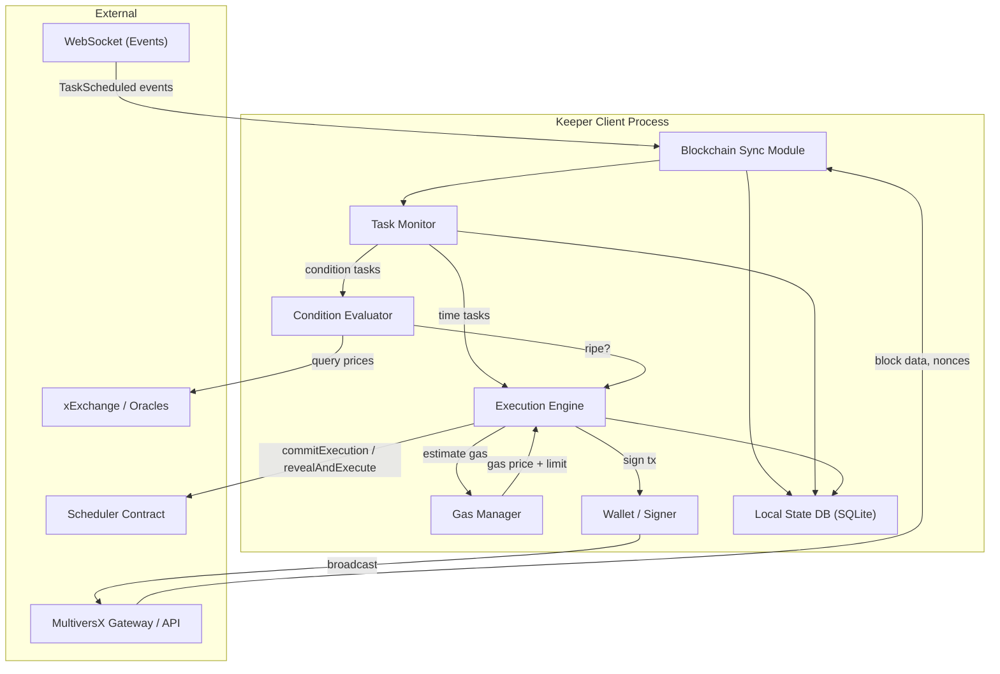
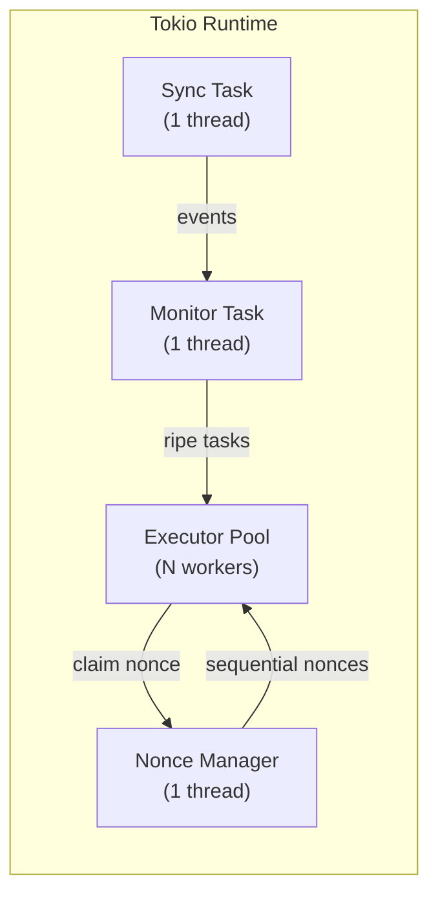

# XCron Protocol — Keeper Client Specification

> **Version:** 0.1.0-draft | **Date:** 2026-02-17 | **Status:** Pre-implementation

---

## 1. Overview

The **Keeper Client** is the off-chain software that operators run to participate in the XCron network. It monitors the blockchain for ripe tasks, competes to execute them via the commit-reveal protocol, and claims rewards.

### Tech Stack Decision

| Option | Pros | Cons | **Recommendation** |
|---|---|---|---|
| **Rust** | Native MultiversX SDK (`sdk-rs`), max performance, shared types with SC | Steeper learning curve for operators | ✅ **Primary** |
| **TypeScript** | Developer-friendly, `sdk-js` mature | Slower, GC pauses | Lightweight/community client |
| **Python** | Rapid prototyping | No official SDK, poor perf | ❌ Not recommended |

> [!IMPORTANT]
> The primary keeper client **must** be written in Rust to share data structures with the smart contracts (zero-cost deserialization of `Task`, `Trigger`, etc.) and to achieve the sub-second latency required for competitive execution.

---

## 2. Architecture



---

## 3. Module Details

### 3.1 Blockchain Sync Module

**Responsibility:** Maintain a real-time view of the blockchain state relevant to the keeper.

```rust
pub struct SyncModule {
    gateway_url:    String,
    ws_url:         String,
    current_round:  AtomicU64,
    current_epoch:  AtomicU64,
    shard_id:       u8,              // shard this keeper monitors
    event_channel:  mpsc::Sender<BlockchainEvent>,
}

impl SyncModule {
    /// Subscribe to Scheduler contract events via WebSocket.
    pub async fn start(&self) -> Result<()> {
        // 1. Connect to MultiversX WebSocket endpoint
        // 2. Subscribe to logs matching Scheduler contract address
        // 3. Parse events: TaskScheduled, TaskCancelled, TaskExpired, CommitSubmitted
        // 4. Forward parsed events to event_channel
        // 5. Periodically poll /network/status for round/epoch updates
    }

    /// Fallback: poll API every N seconds for new blocks.
    pub async fn poll_fallback(&self, interval: Duration) -> Result<()> {
        loop {
            let status = self.api_client.get_network_status().await?;
            self.current_round.store(status.round, Ordering::Relaxed);
            // Query Scheduler view functions for pending tasks
            tokio::time::sleep(interval).await;
        }
    }
}
```

**MultiversX API Endpoints Used:**

| Endpoint | Purpose |
|---|---|
| `GET /network/status/{shard}` | Current round, nonce, epoch |
| `GET /address/{scheduler}/keys` | Read contract storage (task data) |
| `GET /hyperblock/by-nonce/{nonce}` | Get block with SmartContractResults |
| `WebSocket /websocket` | Real-time event stream |
| `POST /transaction/send` | Broadcast signed transactions |
| `POST /transaction/cost` | Estimate transaction gas |

### 3.2 Task Monitor

**Responsibility:** Evaluate which pending tasks are "ripe" and eligible for execution.

```rust
pub struct TaskMonitor {
    db:            Arc<SqlitePool>,
    sync:          Arc<SyncModule>,
    evaluator:     Arc<ConditionEvaluator>,
    exec_channel:  mpsc::Sender<RipeTask>,
}

impl TaskMonitor {
    /// Main loop: runs every round.
    pub async fn run(&self) -> Result<()> {
        loop {
            let current_round = self.sync.current_round();

            // ── Time-based tasks ──────────────────────────
            let time_tasks = self.db.get_pending_time_tasks(current_round).await?;
            for task in time_tasks {
                if self.should_attempt(&task) {
                    self.exec_channel.send(RipeTask::from(task)).await?;
                }
            }

            // ── Condition-based tasks ─────────────────────
            let cond_tasks = self.db.get_pending_condition_tasks().await?;
            for task in cond_tasks {
                if self.evaluator.evaluate(&task.trigger).await? {
                    self.exec_channel.send(RipeTask::from(task)).await?;
                }
            }

            tokio::time::sleep(Duration::from_secs(6)).await; // configurable poll interval
        }
    }

    /// Profitability check: is it worth executing this task?
    fn should_attempt(&self, task: &Task) -> bool {
        let estimated_gas_cost = self.estimate_execution_cost(task);
        let expected_reward = self.estimate_reward(task);
        let profit = expected_reward.saturating_sub(estimated_gas_cost);

        // Only attempt if profit > minimum threshold
        profit > self.config.min_profit_threshold
    }
}
```

### 3.3 Condition Evaluator

```rust
pub struct ConditionEvaluator {
    api_client: MultiversXApiClient,
}

impl ConditionEvaluator {
    /// Query an on-chain view function and compare result against threshold.
    pub async fn evaluate(&self, trigger: &Trigger) -> Result<bool> {
        match trigger {
            Trigger::ConditionOnChain {
                oracle_contract,
                query_endpoint,
                query_args,
                comparator,
                threshold,
            } => {
                // Execute VM query (read-only, no gas cost)
                let result = self.api_client
                    .vm_query(oracle_contract, query_endpoint, query_args)
                    .await?;

                let value = BigUint::from_bytes_be(&result.return_data[0]);

                Ok(match comparator {
                    Comparator::Gt  => value > *threshold,
                    Comparator::Lt  => value < *threshold,
                    Comparator::Eq  => value == *threshold,
                    Comparator::Gte => value >= *threshold,
                    Comparator::Lte => value <= *threshold,
                })
            },
            _ => Ok(false), // Time triggers handled by TaskMonitor
        }
    }
}
```

### 3.4 Execution Engine

The core competitive execution logic implementing the commit-reveal protocol.

```rust
pub struct ExecutionEngine {
    wallet:     Arc<WalletSigner>,
    gas_mgr:    Arc<GasManager>,
    db:         Arc<SqlitePool>,
    api_client: MultiversXApiClient,
    config:     KeeperConfig,
}

impl ExecutionEngine {
    /// Process a ripe task through the commit-reveal pipeline.
    pub async fn execute(&self, task: RipeTask) -> Result<ExecutionResult> {
        // ── Phase 1: Commit ──────────────────────────────
        let salt = self.generate_salt();
        let commit_hash = self.compute_commit_hash(task.id, &self.wallet.address(), &salt);

        let commit_tx = self.build_commit_tx(task.id, &commit_hash).await?;
        let commit_result = self.broadcast_and_wait(commit_tx).await?;

        if !commit_result.success {
            // Another keeper committed first, or task no longer pending
            log::info!("Commit failed for task {}: {}", task.id, commit_result.error);
            return Ok(ExecutionResult::CommitFailed);
        }

        // Store salt locally for reveal phase
        self.db.store_commit(task.id, &salt).await?;

        // ── Phase 2: Reveal & Execute ────────────────────
        // Wait 1-2 rounds to let the commit confirm (avoid same-block reveal)
        tokio::time::sleep(Duration::from_secs(6)).await;

        let reveal_tx = self.build_reveal_tx(task.id, &salt).await?;
        let reveal_result = self.broadcast_and_wait(reveal_tx).await?;

        if reveal_result.success {
            log::info!("Task {} executed successfully", task.id);
            self.db.mark_executed(task.id).await?;
            Ok(ExecutionResult::Success {
                tx_hash: reveal_result.tx_hash,
                gas_used: reveal_result.gas_used,
            })
        } else {
            log::warn!("Task {} execution failed: {}", task.id, reveal_result.error);
            Ok(ExecutionResult::ExecutionFailed {
                error: reveal_result.error,
            })
        }
    }

    fn compute_commit_hash(
        &self,
        task_id: u64,
        keeper_addr: &Address,
        salt: &[u8],
    ) -> [u8; 32] {
        let mut hasher = Keccak256::new();
        hasher.update(&task_id.to_be_bytes());
        hasher.update(keeper_addr.as_bytes());
        hasher.update(salt);
        hasher.finalize().into()
    }

    fn generate_salt(&self) -> Vec<u8> {
        let mut salt = vec![0u8; 32];
        OsRng.fill_bytes(&mut salt);
        salt
    }

    async fn build_commit_tx(&self, task_id: u64, hash: &[u8; 32]) -> Result<Transaction> {
        let gas_estimate = self.gas_mgr.estimate_commit_gas().await?;
        let nonce = self.api_client.get_account_nonce(&self.wallet.address()).await?;
        let commit_bond = self.get_commit_bond().await?;

        Ok(Transaction {
            nonce,
            value: commit_bond,
            receiver: self.config.scheduler_address.clone(),
            sender: self.wallet.address(),
            gas_price: self.gas_mgr.current_gas_price().await?,
            gas_limit: gas_estimate,
            data: format!(
                "commitExecution@{}@{}",
                hex::encode(task_id.to_be_bytes()),
                hex::encode(hash),
            ),
            chain_id: self.config.chain_id.clone(),
            ..Default::default()
        })
    }
}
```

### 3.5 Gas Manager

```rust
pub struct GasManager {
    api_client:      MultiversXApiClient,
    gas_price_cache: RwLock<GasPriceCache>,
    config:          GasConfig,
}

pub struct GasConfig {
    /// Multiplier over estimated gas to ensure inclusion (e.g., 1.2 = 20% buffer)
    pub gas_limit_multiplier: f64,
    /// Maximum gas price the keeper is willing to pay (in EGLD denomination)
    pub max_gas_price: u64,
    /// Maximum total cost per execution (abort if estimated cost exceeds this)
    pub max_execution_cost_egld: f64,
}

impl GasManager {
    /// Estimate gas for a transaction using the /transaction/cost endpoint.
    pub async fn estimate_gas(&self, tx: &Transaction) -> Result<u64> {
        let cost_response = self.api_client.estimate_tx_cost(tx).await?;
        let base_gas = cost_response.tx_gas_units;
        let buffered = (base_gas as f64 * self.config.gas_limit_multiplier) as u64;
        Ok(buffered)
    }

    /// Get current network gas price with caching (refresh every 30s).
    pub async fn current_gas_price(&self) -> Result<u64> {
        let cache = self.gas_price_cache.read().await;
        if cache.is_fresh() {
            return Ok(cache.price);
        }
        drop(cache);

        let status = self.api_client.get_network_status(4294967295).await?;
        let price = status.min_gas_price;

        let mut cache = self.gas_price_cache.write().await;
        cache.price = price;
        cache.updated_at = Instant::now();
        Ok(price)
    }

    /// Check if executing a task is economically viable.
    pub fn is_profitable(&self, estimated_gas: u64, gas_price: u64, expected_reward: u64) -> bool {
        let cost = estimated_gas as u128 * gas_price as u128;
        let reward = expected_reward as u128;
        reward > cost
    }
}
```

---

## 4. Concurrency Model



### Nonce Management (Critical)

MultiversX transaction nonces must be strictly sequential. Concurrent execution requires a centralized nonce allocator:

```rust
pub struct NonceManager {
    current_nonce: AtomicU64,
    api_client:    MultiversXApiClient,
    keeper_addr:   Address,
}

impl NonceManager {
    /// Initialize from on-chain nonce.
    pub async fn init(&self) -> Result<()> {
        let nonce = self.api_client.get_account_nonce(&self.keeper_addr).await?;
        self.current_nonce.store(nonce, Ordering::SeqCst);
        Ok(())
    }

    /// Atomically claim the next nonce.
    pub fn next_nonce(&self) -> u64 {
        self.current_nonce.fetch_add(1, Ordering::SeqCst)
    }

    /// Periodically re-sync with chain to recover from gaps.
    pub async fn resync(&self) -> Result<()> {
        let on_chain = self.api_client.get_account_nonce(&self.keeper_addr).await?;
        let local = self.current_nonce.load(Ordering::SeqCst);
        if on_chain > local {
            self.current_nonce.store(on_chain, Ordering::SeqCst);
        }
        Ok(())
    }
}
```

---

## 5. Error Handling Strategy

| Error Scenario | Detection | Recovery |
|---|---|---|
| **API unavailable** | HTTP timeout / connection refused | Exponential backoff (1s → 2s → 4s → max 60s); switch to backup gateway |
| **Transaction rejected** (bad nonce) | `invalidNonce` error | Re-sync nonce from chain, retry |
| **Transaction rejected** (insufficient gas) | `insufficientGas` error | Increase gas limit by 50%, retry once |
| **Commit race lost** | `Task not Pending` revert | Log, skip task, no penalty |
| **Reveal window expired** | Missed deadline | Log error, alert operator; bond is lost |
| **Wallet balance low** | Pre-flight check | Alert operator, pause execution until funded |
| **DB corruption** | SQLite integrity check | Rebuild from on-chain state |

---

## 6. Configuration

```toml
# keeper-config.toml

[network]
chain_id = "1"                          # "1" = mainnet, "T" = testnet, "D" = devnet
gateway_url = "https://gateway.multiversx.com"
api_url = "https://api.multiversx.com"
ws_url = "wss://ws.multiversx.com"
backup_gateways = [
    "https://gateway-02.multiversx.com",
    "https://gateway-03.multiversx.com",
]

[contracts]
scheduler_shard_0 = "erd1qqqqqqqqqqqqqpgq..."
scheduler_shard_1 = "erd1qqqqqqqqqqqqqpgq..."
scheduler_shard_2 = "erd1qqqqqqqqqqqqqpgq..."
keeper_registry   = "erd1qqqqqqqqqqqqqpgq..."
rewards           = "erd1qqqqqqqqqqqqqpgq..."

[keeper]
# Path to PEM or keystore file
wallet_path = "./keeper-wallet.pem"
# Shards to monitor (empty = all)
monitored_shards = [0, 1, 2]
# Max concurrent executions
max_concurrent = 4
# Minimum profit threshold in EGLD (below this, skip task)
min_profit_egld = 0.001

[gas]
gas_limit_multiplier = 1.25
max_gas_price = 1_000_000_000
max_execution_cost_egld = 0.5

[health]
# Metrics endpoint for Prometheus/Grafana
metrics_port = 9090
# Alert webhook (Slack, Discord, etc.)
alert_webhook = "https://hooks.slack.com/services/..."
```

---

## 7. Deployment & Operations

### System Requirements

| Resource | Minimum | Recommended |
|---|---|---|
| **CPU** | 2 cores | 4+ cores |
| **RAM** | 2 GB | 4 GB |
| **Storage** | 10 GB SSD | 50 GB SSD |
| **Network** | 50 Mbps | 100+ Mbps |
| **OS** | Linux (Ubuntu 22.04+) | Linux |

### Docker Deployment

```dockerfile
FROM rust:1.75 as builder
WORKDIR /app
COPY . .
RUN cargo build --release --bin xcron-keeper

FROM debian:bookworm-slim
RUN apt-get update && apt-get install -y ca-certificates && rm -rf /var/lib/apt/lists/*
COPY --from=builder /app/target/release/xcron-keeper /usr/local/bin/
COPY keeper-config.toml /etc/xcron/
EXPOSE 9090
CMD ["xcron-keeper", "--config", "/etc/xcron/keeper-config.toml"]
```

### Monitoring

The keeper exposes Prometheus metrics:

| Metric | Type | Description |
|---|---|---|
| `xcron_tasks_monitored` | Gauge | Number of pending tasks being tracked |
| `xcron_executions_total` | Counter | Total executions attempted |
| `xcron_executions_success` | Counter | Successful executions |
| `xcron_executions_failed` | Counter | Failed executions |
| `xcron_commit_races_lost` | Counter | Times another keeper committed first |
| `xcron_rewards_earned_egld` | Counter | Total EGLD earned |
| `xcron_gas_spent_egld` | Counter | Total EGLD spent on gas |
| `xcron_wallet_balance_egld` | Gauge | Current wallet balance |
| `xcron_sync_lag_rounds` | Gauge | Rounds behind chain head |
