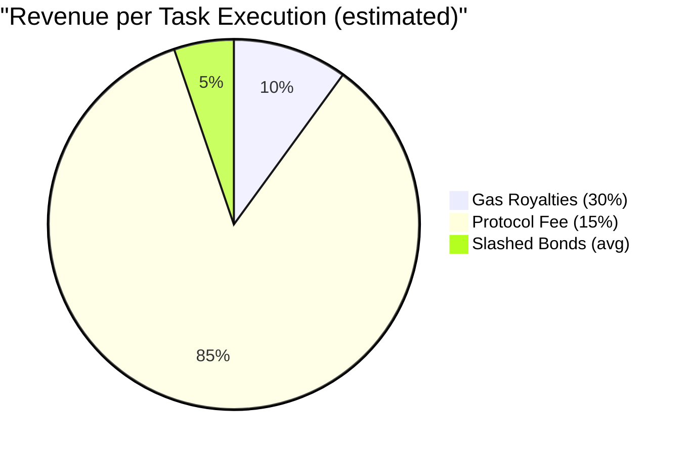
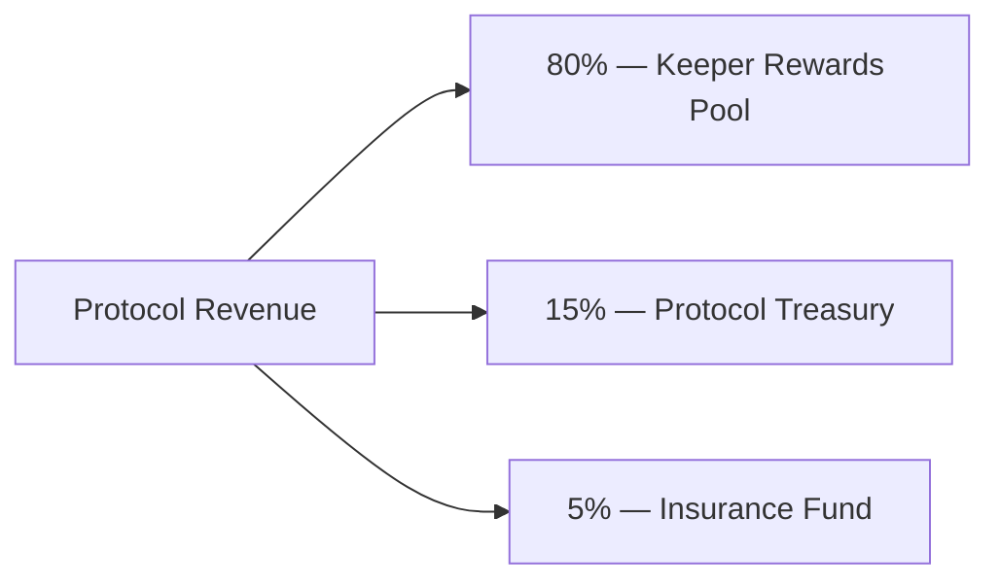

# XCron Protocol — Economic Model (Tokenomics)

> **Version:** 0.1.0-draft | **Date:** 2026-02-17 | **Status:** Pre-implementation

---

## 1. Revenue Streams

### 1.1 MultiversX Gas Royalties (30%)

MultiversX grants smart contract developers **30% of all gas fees** consumed by transactions interacting with their contracts. This is automatic and requires no additional logic.

| Interaction | Avg Gas Used | Avg Gas Fee (EGLD) | 30% Royalty |
|---|---|---|---|
| `scheduleTask` | 20M | 0.001 EGLD | 0.0003 EGLD |
| `commitExecution` | 12M | 0.0006 EGLD | 0.00018 EGLD |
| `revealAndExecute` | 35M | 0.00175 EGLD | 0.000525 EGLD |
| `cancelTask` | 10M | 0.0005 EGLD | 0.00015 EGLD |
| **Total per execution cycle** | ~67M | ~0.00385 EGLD | **~0.00116 EGLD** |

> [!NOTE]
> Gas royalties are deposited directly to the contract owner address by the protocol. They accumulate passively and scale linearly with usage.

### 1.2 Protocol Fee (per task)

A configurable fee taken from the task owner's deposit upon successful execution:

```
protocol_fee = task.deposit × protocol_fee_bps / 10,000
```

**Default:** `protocol_fee_bps = 1500` (15%) — MultiversX ecosystem rate. For other chains: 20% (2,000 BPS).

### 1.3 Commit Bond Slashing

When a keeper fails to reveal within the reveal window, their commit bond is forfeited to the protocol treasury. This is a secondary, penalty-based revenue stream.

### 1.4 Revenue Summary



---

## 2. Keeper Incentives

### 2.1 Reward Formula

For each successful execution, the keeper receives:

```
keeper_reward = gas_reimbursement + execution_bonus

where:
  gas_reimbursement = actual_gas_used × gas_price × (1 + GAS_MARGIN)
  execution_bonus   = base_bonus × reputation_multiplier
```

| Parameter | Default Value | Source |
|---|---|---|
| `GAS_MARGIN` | 15% (1500 bps) | Covers gas estimation variance and incentivizes execution |
| `base_bonus` | 0.0005 EGLD | Protocol treasury / task owner deposit |
| `reputation_multiplier` | 1.0 – 1.5× | Based on keeper's historical success rate |

### 2.2 Reputation Multiplier

```
reputation_multiplier = min(1.5, 1.0 + (successful_execs / total_execs - 0.9) × 5)
```

| Success Rate | Multiplier | Effective Bonus |
|---|---|---|
| < 90% | 1.0× (floor) | 0.0005 EGLD |
| 95% | 1.25× | 0.000625 EGLD |
| 98% | 1.4× | 0.0007 EGLD |
| 100% | 1.5× (cap) | 0.00075 EGLD |

### 2.3 Keeper Profitability Model

Assuming a keeper executes **100 tasks/day**:

| Item | Per Task | Daily (100 tasks) | Monthly |
|---|---|---|---|
| Gas cost (paid by keeper) | -0.00175 EGLD | -0.175 EGLD | -5.25 EGLD |
| Gas reimbursement (115%) | +0.002013 EGLD | +0.2013 EGLD | +6.04 EGLD |
| Execution bonus | +0.0005 EGLD | +0.05 EGLD | +1.50 EGLD |
| Commit bond lock (temporary) | -0.01 EGLD | Recycled | — |
| **Net profit** | **+0.000763 EGLD** | **+0.0763 EGLD** | **+2.29 EGLD** |

> At EGLD ≈ $40, monthly keeper profit ≈ **$91.60** for 100 tasks/day, scaling linearly.

---

## 3. Economic Security

### 3.1 Stake Requirements

The minimum stake creates a security bond that must exceed the potential damage a malicious keeper could inflict:

```
min_stake ≥ max_task_value × SECURITY_RATIO
```

| Parameter | Value | Rationale |
|---|---|---|
| `min_stake` | 10 EGLD ($400) | Barrier to entry; meaningful for small operators |
| `SECURITY_RATIO` | 5× | Keeper stake must cover 5× the max value of any single task they execute |
| `max_task_deposit` | 2 EGLD (per task) | Upper bound for Phase 2; governance can adjust |

### 3.2 Slashing Conditions

| Violation | Detection | Slash % | Notes |
|---|---|---|---|
| Missed reveal window | Automatic (on-chain timer) | Commit bond only (no stake slash) | Mild penalty; could be network issue |
| Submitted wrong arguments | Argument hash mismatch with task data | 10% of stake | Detectable on-chain |
| Repeated failures (>5 in 24h) | Automated monitoring by Rewards contract | 5% of stake | Suggests unreliable infrastructure |
| Proven malicious execution | Governance vote + evidence | 50% of stake | Manual process; requires dispute resolution |
| Active collusion (provable) | Governance vote | 100% of stake | Nuclear option; requires cryptographic evidence |

### 3.3 Security Invariant

The system maintains a **Security Ratio** at all times:

```
Total Staked EGLD / Total Pending Task Deposits ≥ 3.0
```

If this ratio drops below 3.0, the Scheduler contract increases `min_deposit` per task (reducing max task value relative to available stake) until equilibrium is restored. This is enforced on-chain.

---

## 4. Treasury Management

### 4.1 Revenue Allocation

All protocol revenue flows into the Rewards contract, which splits it:



| Fund | Purpose | Governance |
|---|---|---|
| **Keeper Rewards Pool** (80%) | Fund execution bonuses beyond gas reimbursement | Automatic distribution |
| **Protocol Treasury** (15%) | Development, audits, marketing, team compensation | Governance multisig |
| **Insurance Fund** (5%) | Compensate task owners if a keeper causes provable damage | Governance vote to release |

### 4.2 Sustainability Projections

**Assumptions:**
- EGLD price: $40
- Average gas per execution cycle: 67M units
- Gas price: 1,000,000,000 (denomination units)

#### Scenario A: Low Adoption (50 tasks/day)

| Metric | Monthly |
|---|---|
| Total executions | 1,500 |
| Gas royalties | 1.74 EGLD ($69.60) |
| Protocol fees (15%) | Variable, est. ~9 EGLD ($360) |
| **Total protocol revenue** | **~7.74 EGLD ($309.60)** |
| Keeper payouts | ~3.80 EGLD |
| **Net treasury** | **~3.94 EGLD ($157.60)** |

#### Scenario B: Medium Adoption (500 tasks/day)

| Metric | Monthly |
|---|---|
| Total executions | 15,000 |
| Gas royalties | 17.4 EGLD ($696) |
| Protocol fees | ~60 EGLD ($2,400) |
| **Total protocol revenue** | **~77.4 EGLD ($3,096)** |
| Keeper payouts | ~38 EGLD |
| **Net treasury** | **~39.4 EGLD ($1,576)** |

#### Scenario C: High Adoption (5,000 tasks/day)

| Metric | Monthly |
|---|---|
| Total executions | 150,000 |
| Gas royalties | 174 EGLD ($6,960) |
| Protocol fees | ~600 EGLD ($24,000) |
| **Total protocol revenue** | **~774 EGLD ($30,960)** |
| Keeper payouts | ~380 EGLD |
| **Net treasury** | **~394 EGLD ($15,760)** |

### 4.3 Break-Even Analysis

```
Monthly fixed costs (estimated):
  - Infrastructure (API nodes, monitoring): $200/mo
  - Ongoing development (1 FTE): $5,000/mo
  - Total: $5,200/mo

Break-even at EGLD = $40:
  Required net revenue = $5,200/mo
  Required treasury income = 130 EGLD/mo
  Required task volume ≈ 1,270 tasks/day (Scenario B range)
```

> [!WARNING]
> Pre-revenue phases (1–2) will require external funding. The protocol should budget **12 months of runway** ($62,400 at current estimates) before reaching break-even volume.

---

## 5. Token Considerations (Future — Phase 4+)

The initial design operates purely in **EGLD** (no native token). This reduces regulatory risk and simplifies the MVP. A protocol governance token may be introduced in Phase 4 if:

1. The keeper network reaches sufficient decentralization (>20 active keepers)
2. Governance decisions become frequent enough to warrant on-chain voting weight
3. The community demonstrates demand for protocol-level staking

**Potential token utility (if introduced):**
- Governance voting weight
- Fee discounts for task schedulers
- Keeper reputation boosting
- Protocol revenue sharing

> [!IMPORTANT]
> We explicitly recommend **against** launching a token at protocol inception. EGLD-native operation provides simpler UX, avoids regulatory complexity, and aligns with the MultiversX ecosystem philosophy.
