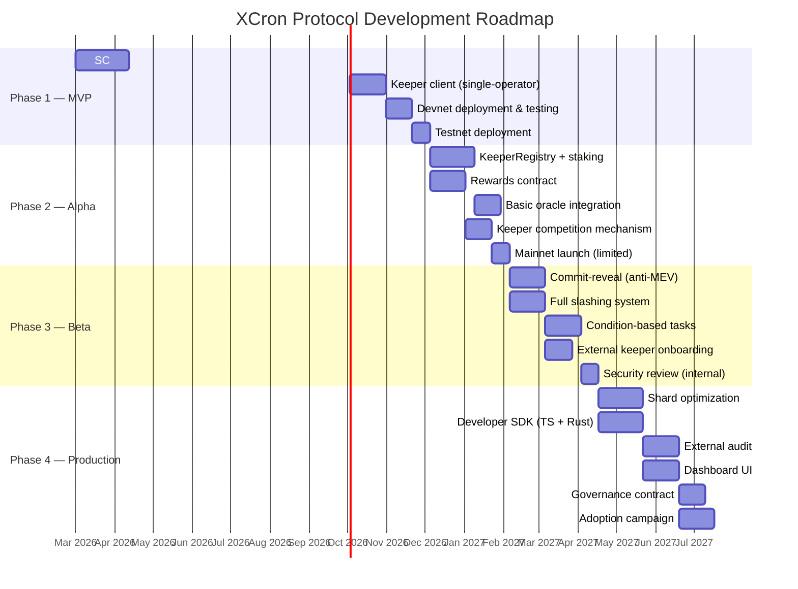

# XCron Protocol — Implementation Roadmap

> **Version:** 0.1.0-draft | **Date:** 2026-02-17 | **Status:** Pre-implementation

---

## Timeline Overview

---

## Phase 1 — MVP (Weeks 1–15)

**Goal:** Prove the core concept works end-to-end on testnet.

### Scope

| Deliverable | Description |
|---|---|
| **Scheduler Contract v0.1** | `scheduleTask`, `cancelTask`, `executeTask` (direct call, no commit-reveal) |
| **Trigger support** | `TimeOnce` only (execute at target round) |
| **Keeper Client v0.1** | Single process, single shard, operated by the team |
| **No staking/slashing** | Keeper is whitelisted; no economic game yet |
| **Deployment** | Devnet → Testnet |

### Milestones

- [ ] **M1.1** — Scheduler contract compiles, unit tests pass *(Week 6)*
- [ ] **M1.2** — Keeper client executes a time-based task on devnet *(Week 10)*
- [ ] **M1.3** — 100 tasks scheduled and executed successfully on testnet *(Week 14)*
- [ ] **M1.4** — Demo video and technical blog post published *(Week 15)*

### Constraints

- No EGLD at risk (testnet only)
- Team operates the sole keeper node
- No condition-based tasks

---

## Phase 2 — Alpha (Weeks 16–30)

**Goal:** Introduce economic incentives and open limited mainnet access.

### Scope

| Deliverable | Description |
|---|---|
| **KeeperRegistry Contract** | Register keeper, stake EGLD, request unstake, cooldown, withdraw |
| **Rewards Contract** | Receive execution fees, calculate keeper reward, claim payout |
| **Scheduler v0.2** | Protocol fee deduction, keeper validation, basic competition (first-come-first-served) |
| **TimeRecurring trigger** | Recurring task support |
| **Oracle integration** | Read xExchange pair prices via VM query for condition evaluation |
| **Keeper Client v0.2** | Multi-shard monitoring, profitability check, EGLD balance alerts |

### Milestones

- [ ] **M2.1** — KeeperRegistry + Rewards deployed on testnet *(Week 20)*
- [ ] **M2.2** — 3 independent keepers register and compete on testnet *(Week 24)*
- [ ] **M2.3** — Oracle-based condition task executed on testnet *(Week 27)*
- [ ] **M2.4** — Mainnet deployment with `max_task_deposit = 0.5 EGLD` cap *(Week 30)*

### Launch Parameters (Mainnet Alpha)

| Parameter | Value |
|---|---|
| `min_stake` | 10 EGLD |
| `max_task_deposit` | 0.5 EGLD |
| `protocol_fee_bps` | 1500 (15%) |
| `GAS_MARGIN` | 1500 bps (15%) |
| `cooldown_rounds` | ~14,400 (≈24h at 6s/round) |
| Max keepers | 10 (whitelisted) |

---

## Phase 3 — Beta (Weeks 31–48)

**Goal:** Production-grade security and open keeper participation.

### Scope

| Deliverable | Description |
|---|---|
| **Commit-Reveal Protocol** | Two-phase execution for anti-front-running |
| **Full Slashing** | Automated slashing for missed reveals, argument mismatch |
| **ConditionOnChain trigger** | Generic on-chain condition evaluation with comparators |
| **Reputation System** | Success rate tracking, reputation multiplier for rewards |
| **External Keeper Onboarding** | Permissionless registration (remove whitelist) |
| **Internal Security Review** | Formal verification of critical paths; fuzzing |

### Milestones

- [ ] **M3.1** — Commit-reveal flow passes 1,000 executions on testnet *(Week 36)*
- [ ] **M3.2** — Slashing test: simulated keeper misbehavior correctly penalized *(Week 40)*
- [ ] **M3.3** — 10+ external keepers active on mainnet *(Week 44)*
- [ ] **M3.4** — 1,000 tasks scheduled by external developers *(Week 48)*

---

## Phase 4 — Production & Scale (Weeks 49–72)

**Goal:** Full ecosystem readiness, external audit, developer adoption.

### Scope

| Deliverable | Description |
|---|---|
| **Shard Optimization** | Per-shard Scheduler proxies, cross-shard async calls |
| **Developer SDK** | TypeScript (NPM) + Rust (Cargo) libraries for `scheduleTask` |
| **Dashboard UI** | Web app: task management, keeper stats, analytics |
| **Governance Contract** | On-chain voting for parameter changes |
| **External Security Audit** | By a top-tier firm (Runtime Verification, Hacken, Certik) |
| **Adoption Campaign** | Integrations with major MultiversX dApps (xExchange, Hatom, AshSwap) |

### Milestones

- [ ] **M4.1** — Per-shard Scheduler live on mainnet *(Week 54)*
- [ ] **M4.2** — SDK published (npm + crates.io) with documentation *(Week 58)*
- [ ] **M4.3** — External audit completed, all findings resolved *(Week 64)*
- [ ] **M4.4** — 3+ major dApp integrations live *(Week 68)*
- [ ] **M4.5** — Dashboard UI public launch *(Week 70)*
- [ ] **M4.6** — 50+ active keepers, 5,000+ tasks/day *(Week 72)*

---

## Team Composition

| Role | Phase 1–2 | Phase 3–4 |
|---|---|---|
| **Smart Contract Engineer (Rust)** | 1 | 2 |
| **Backend Engineer (Keeper Client)** | 1 | 1 |
| **Full-stack Engineer (SDK + UI)** | 0 | 1 |
| **DevOps / SRE** | 0.5 | 1 |
| **Security Researcher** | 0 | 0.5 |
| **Product / BD** | 0.5 | 1 |
| **Total FTEs** | **3** | **6.5** |

---

## Key Performance Indicators (KPIs)

| KPI | Phase 2 Target | Phase 4 Target |
|---|---|---|
| Tasks scheduled (cumulative) | 500 | 100,000 |
| Tasks executed successfully | 95%+ | 99%+ |
| Active keepers | 10 | 50+ |
| Unique developers using SDK | 5 | 50+ |
| Protocol revenue (monthly EGLD) | 5 EGLD | 100+ EGLD |
| Mean time-to-execution (from ripe to executed) | < 2 rounds (12s) | < 1 round (6s) |
| Task verification success rate | 98% | 99.9% |
