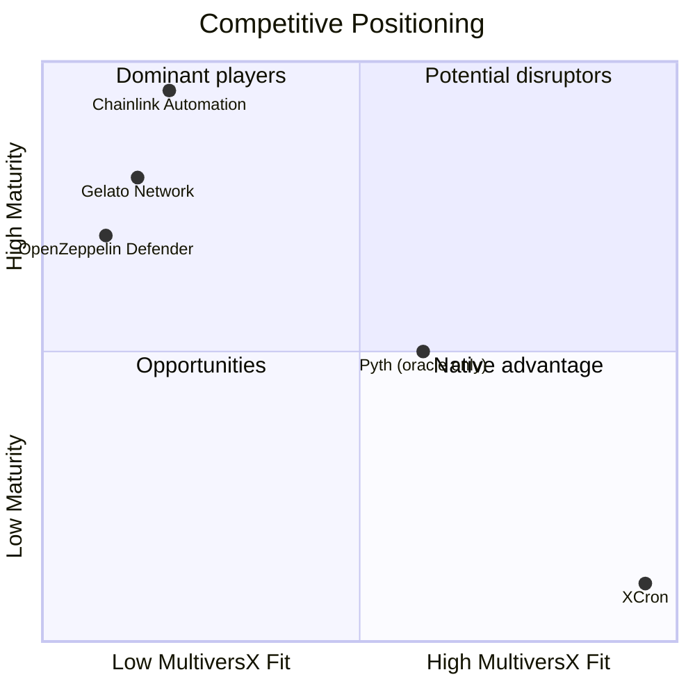
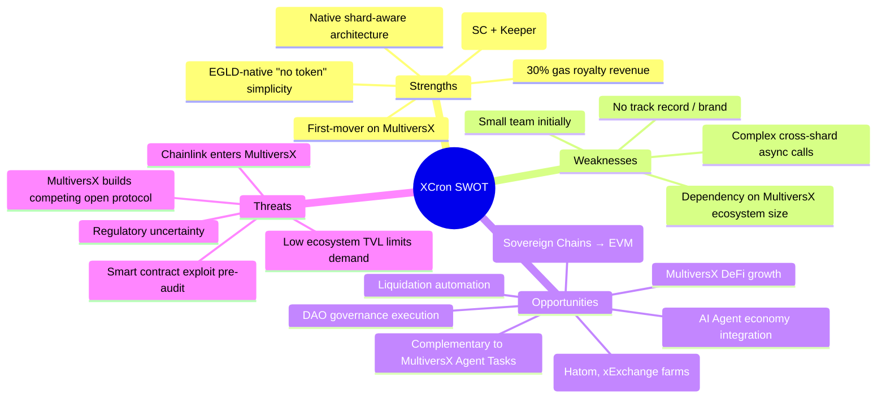

# XCron Protocol — Risk & Competition Analysis

> **Version:** 0.1.0-draft | **Date:** 2026-02-17 | **Status:** Pre-implementation

---

## 1. Competitive Landscape

### 1.1 Direct Competitors

| Protocol | Chain(s) | Model | TVL Protected | MultiversX Support |
|---|---|---|---|---|
| **Chainlink Automation** | Ethereum, Polygon, Arbitrum, Avalanche, BSC | DON-based, off-chain computation | $10B+ | ❌ None (oracle data feeds only) |
| **Gelato Network** | Ethereum, Polygon, Arbitrum, Optimism, BSC | Relay network + Web3 Functions | $1B+ | ❌ None |
| **OpenZeppelin Defender** | Ethereum, Polygon, others | Centralized relayer SaaS | N/A | ❌ None |
| **Pyth Network** | 40+ chains | Oracle-first, push-based updates | N/A | ✅ Data feeds only |
| **MultiversX Agent Tasks** | MultiversX | App-layer AI agent scheduling | N/A | ✅ xPortal only (centralized) |
| **XCron (proposed)** | MultiversX | Native decentralized keeper network | — | ✅ Native |

> [!NOTE]
> **MultiversX Agent Tasks** (launched Feb 12, 2026) provides cron-style scheduling for AI agents within xPortal. However, it is a proprietary app feature, not a decentralized on-chain protocol. XCron is complementary — it provides the decentralized infrastructure layer that Agent Tasks and other applications can leverage.

### 1.2 Competitive Threat Assessment

### 1.3 Why Chainlink/Gelato Won't Easily Enter MultiversX

| Barrier | Impact |
|---|---|
| **Different VM** | MultiversX uses WASM-based VM (not EVM). Chainlink/Gelato contracts are Solidity-native and would require a full rewrite in Rust |
| **Sharding architecture** | MultiversX's adaptive state sharding has no EVM equivalent — existing automation protocols have no shard-aware logic |
| **Small market (currently)** | MultiversX DeFi TVL (~$200M) may not justify the investment for Chainlink ($20B+ ecosystem) to build native support |
| **Gas royalties model** | The 30% royalty model is unique to MultiversX and creates a native revenue stream that cross-chain protocols can't leverage |
| **SDK differences** | `multiversx-sc` framework has different patterns from Solidity — requires dedicated Rust engineering talent |

### 1.4 XCron's Competitive Advantages

| Advantage | Details |
|---|---|
| **First-mover** | No decentralized automation protocol exists natively on MultiversX |
| **Native integration** | Shard-aware execution eliminates cross-shard latency for co-located tasks |
| **Gas royalties** | 30% automatic revenue share is a unique, built-in revenue stream |
| **Ecosystem alignment** | Deep integration with xExchange, Hatom, AshSwap from day one |
| **Simplicity** | EGLD-native (no additional token), reducing user friction |

---

## 2. Risk Matrix

### 2.1 Technical Risks

| Risk | Likelihood | Impact | Mitigation |
|---|---|---|---|
| **Smart contract vulnerability** | Medium | Critical | Formal verification, external audit (Phase 4), bug bounty program, upgradeable proxy pattern |
| **Cross-shard async call failures** | Medium | High | Graceful degradation (fall back to Metachain-only); extensive devnet testing |
| **Gas estimation inaccuracy** | High | Medium | Conservative 25% buffer; keeper gas manager auto-adjusts; post-failure retry with higher gas |
| **Keeper nonce management race** | Medium | Medium | Centralized nonce allocator per keeper; periodic re-sync from chain |
| **MultiversX VM breaking changes** | Low | High | Pin `multiversx-sc` version; test against nightly SDK releases; maintain compatibility matrix |
| **Commit-reveal griefing** (spam commits without reveal) | Medium | Medium | Commit bond makes griefing expensive; bond scales with task value |
| **Oracle manipulation** | Medium | High | Use TWAP (time-weighted average price) over multiple rounds instead of spot price; multi-oracle aggregation in Phase 4 |

### 2.2 Economic Risks

| Risk | Likelihood | Impact | Mitigation |
|---|---|---|---|
| **Insufficient keepers** (centralization) | High (early) | High | Bootstrap with team-operated keepers; subsidized rewards in Phase 2; minimum 3 keepers for mainnet launch |
| **Keeper collusion** | Low | Critical | Commit-reveal randomization; minimum stake; stake-weighted random keeper selection (Phase 3+) |
| **EGLD price crash** (keeper economics unviable) | Medium | High | Rewards denominated in EGLD, adjusts automatically; governance can increase `GAS_MARGIN` |
| **Task deposit drainage** (DOS via cheap tasks) | Medium | Medium | Minimum deposit floor (`min_deposit`); rate limiting per address |
| **Revenue insufficient for sustainability** | Medium | High | Conservative treasury management; 12-month runway before break-even; explore grants (MultiversX Growth Fund) |

### 2.3 Market & Adoption Risks

| Risk | Likelihood | Impact | Mitigation |
|---|---|---|---|
| **Low developer adoption** | High | Critical | SDK must be dead-simple; provide templates for common use cases (auto-compound, liquidation bots, governance execution); hackathon sponsorships |
| **MultiversX ecosystem contraction** | Medium | Critical | Diversification plan: abstract core protocol for potential cross-chain deployment (Cosmos, Solana) in Phase 5+ |
| **MultiversX expands Agent Tasks to open protocol** | Medium | High | Position XCron as complementary decentralized layer; offer guarantees (staking/slashing) that centralized features cannot; build partnerships early |
| **Competing project launches on MultiversX** | Low | High | Move fast, build partnerships, establish brand; first-mover advantage + deep ecosystem ties |
| **Regulatory pressure on automation** | Low | Medium | No native token initially; keeper operation is permissionless (like running a validator); legal counsel for key jurisdictions |
| **Dependency on xExchange for oracle** | High | Medium | Build abstraction layer for oracle sources; integrate Pyth when available; support custom oracle contracts |

---

## 3. SWOT Summary

---

## 4. Key Use Cases Driving Adoption

| Use Case | Target dApp | Task Type | Volume Potential |
|---|---|---|---|
| **Auto-compound LP rewards** | xExchange, AshSwap | TimeRecurring (every 24h) | Hundreds of users × daily |
| **Liquidation bots** | Hatom Protocol | ConditionOnChain (health factor < 1) | Event-driven, high value |
| **Limit orders** | xExchange | ConditionOnChain (price threshold) | High demand from traders |
| **DAO proposal execution** | Any DAO | TimeOnce (after voting period) | Low volume, high value |
| **NFT minting triggers** | NFT launchpads | TimeOnce (launch timestamp) | Burst during launches |
| **Token vesting unlocks** | Any project | TimeRecurring (monthly/quarterly) | Steady, predictable |
| **Rebalancing strategies** | DeFi aggregators | ConditionOnChain (portfolio drift) | Medium volume, recurring |

---

## 5. Go-to-Market Strategy

### Phase 2 (Alpha Launch)

1. **Partnerships** — Reach out to Hatom, xExchange, and AshSwap teams for co-development of automation recipes
2. **Builder Program** — Offer 50% fee discount for first 20 dApps integrating XCron
3. **Documentation** — Comprehensive integration guides with copy-paste examples

### Phase 3 (Beta)

4. **Keeper Incentive Program** — Bootstrap keeper network with bonus rewards (2× multiplier for first 3 months)
5. **Hackathon Sponsorship** — Sponsor MultiversX hackathons with prizes for best XCron integration
6. **Content Marketing** — Technical blog posts, video tutorials, Twitter threads demonstrating use cases

### Phase 4 (Production)

7. **Audit Badge** — Prominently display audit results for trust-building
8. **Integration Dashboard** — Public analytics showing tasks executed, reliability metrics, keeper network health
9. **Ecosystem Fund Application** — Apply for MultiversX Growth Fund for scaling
