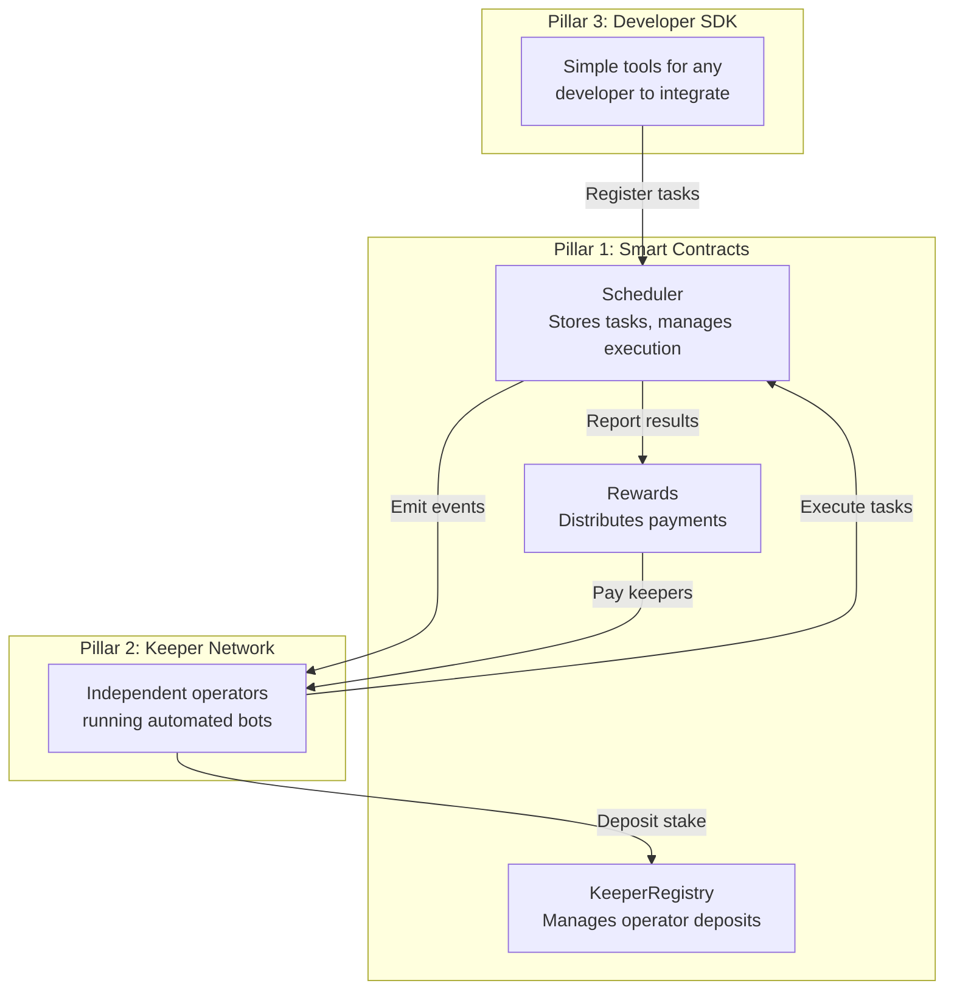
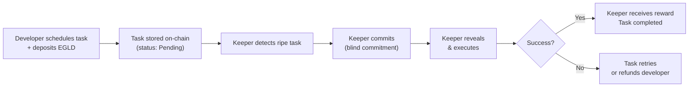
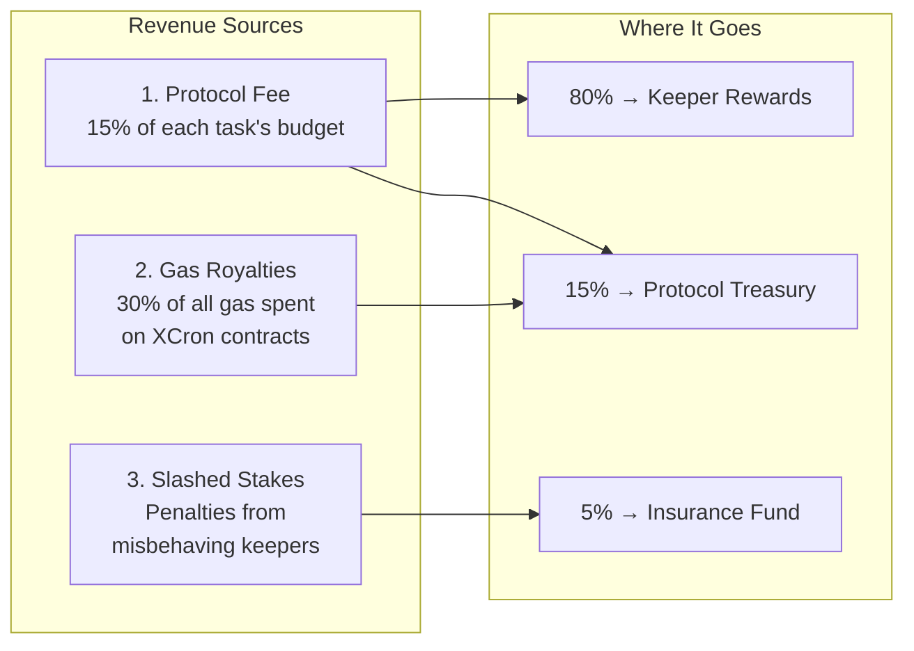
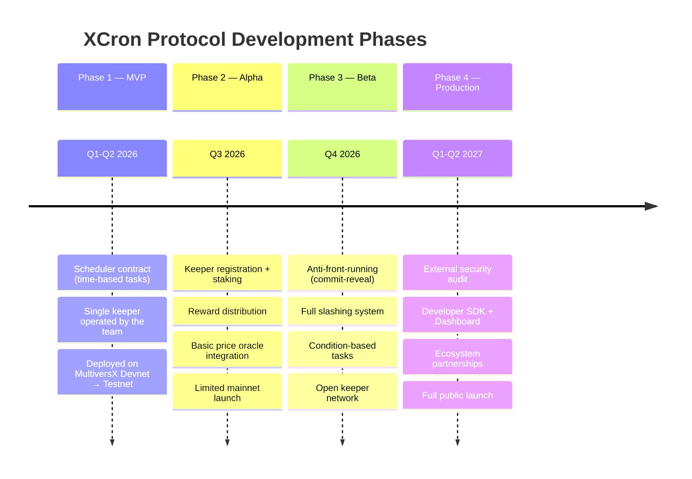

# XCron Protocol

### Decentralized Task Automation for MultiversX


> **Whitepaper v1.2** | February 2026

---

## Table of Contents

1. [Abstract](#1-abstract)
2. [The Problem](#2-the-problem)
3. [The Solution](#3-the-solution--xcron-protocol)
4. [How It Works](#4-how-it-works)
5. [Use Cases](#5-use-cases)
6. [Economic Model](#6-economic-model)
7. [Technology Advantages](#7-technology-advantages)
8. [Competitive Landscape](#8-competitive-landscape)
9. [Roadmap](#9-roadmap)
10. [Risk Factors](#10-risk-factors)
11. [Conclusion](#11-conclusion)

---

## 1. Abstract

Blockchains are among the most secure and transparent systems ever built. But they share a fundamental limitation: **they cannot act on their own**. A smart contract cannot decide to execute at 3 PM, or when a price crosses a threshold, or when a loan becomes risky. It must wait for someone — or something — to tell it to act.

Today, this "someone" is almost always a centralized server. A single point of failure. A contradiction to the very principles blockchain was built upon.

**XCron Protocol** solves this by creating a **decentralized network of automated operators** (called *keepers*) that monitor conditions and execute smart contract functions — on time, every time — without any centralized infrastructure.

XCron is built natively on **MultiversX**, taking full advantage of its unique features: adaptive state sharding, sub-second finality (Supernova), meta-transactions (Relayed v3), the 30% gas royalty model, and the emerging **Agent Economy** infrastructure (MX-8004, x402, MCP).

**There is currently no comparable protocol on MultiversX. XCron is positioned to become the scheduling and automation pillar of the MultiversX Agent Economy.**

---

## 2. The Problem

### 2.1 Blockchains Are Reactive, Not Proactive

Every blockchain — Bitcoin, Ethereum, MultiversX — works the same way at a fundamental level: nothing happens until someone sends a transaction. Smart contracts are powerful, but they are **sleeping giants**. They can only respond; they can never initiate.

This creates a gap. Many real-world financial operations require automatic execution:

| Operation | Requires | Current Solution |
|---|---|---|
| Reinvest DeFi rewards daily | Time-based trigger | Manual click or centralized bot |
| Liquidate an under-collateralized loan | Price-based condition | Centralized liquidation bots |
| Execute a DAO proposal after voting | Time-based trigger | Team member sends transaction manually |
| Place a limit order on a DEX | Price-based condition | Centralized order book server |
| Unlock vested tokens monthly | Time-based trigger | Centralized script on AWS/Google Cloud |

### 2.2 The Centralized "Solution" Is the Problem

Today, every project that needs automation on MultiversX must:

1. **Rent a server** (Amazon AWS, Google Cloud, Hetzner)
2. **Write a bot** that monitors the blockchain
3. **Keep it running 24/7** and hope it doesn't crash
4. **Fund it with EGLD** so it can pay transaction fees
5. **Maintain it forever** — updates, monitoring, alerts

This means:
- **Single point of failure** — if the server crashes, no one executes
- **Censorship risk** — a cloud provider can shut it down
- **Security risk** — the server holds private keys
- **Operational cost** — time, money, and engineering resources
- **Contradiction** — a "decentralized" app depending on a centralized server

### 2.3 The Gap in MultiversX

On Ethereum, protocols like **Chainlink Automation** and **Gelato Network** have solved this problem. But:

- **Neither operates on MultiversX**
- **Neither can be easily ported** — MultiversX uses a completely different virtual machine (WASM) and architecture (Adaptive State Sharding)
- **Neither can leverage** MultiversX's unique features (30% gas royalties, Relayed v3, Supernova)

**MultiversX has no native automation layer. XCron fills this gap.**

---

## 3. The Solution — XCron Protocol

XCron is a **decentralized automation protocol** that allows any smart contract on MultiversX to schedule future actions — triggered by time or conditions — without relying on centralized infrastructure.

### 3.1 Core Concept

Think of XCron as a **decentralized alarm clock for the blockchain**:

1. **A developer** programs a task: *"Call function X on my contract when condition Y is met"*
2. **XCron stores** this task on-chain, with the developer's prepaid execution budget
3. **A network of keepers** (automated bots run by independent operators) monitors the blockchain 24/7
4. **When the condition is met**, a keeper executes the task and receives a reward
5. **If a keeper misbehaves**, they lose their security deposit (stake)

No single entity controls execution. No central server. No trust required.

### 3.2 The Three Pillars



---

## 4. How It Works

### 4.1 For Developers (Who Use XCron)

A developer who wants to automate their smart contract only needs to do three things:

1. **Call `scheduleTask()`** on the XCron Scheduler contract
2. **Specify what to execute** — which contract, which function, what parameters
3. **Deposit EGLD** — to cover the execution cost and keeper reward

That's it. XCron handles the rest.

**Example:** A DeFi protocol wants to auto-compound rewards for its users every 24 hours.

```
scheduleTask(
    target  = "my-defi-contract",
    function = "compoundRewards",
    trigger  = "every 14,400 blocks" (≈ 24h on MultiversX),
    budget   = 0.5 EGLD
)
```

### 4.2 For Keepers (Who Execute Tasks)

A keeper is an automated bot that:

1. **Deposits EGLD as stake** — a security bond proving they have "skin in the game"
2. **Monitors the blockchain** — via MultiversX's real-time WebSocket API
3. **Detects ripe tasks** — tasks whose time has come or whose condition is met
4. **Executes the task** — sends a transaction to the Scheduler contract
5. **Receives a reward** — automatically, from the task owner's prepaid budget

**The keeper software runs completely unattended.** Once configured and deployed (even on a free hosting service), it operates 24/7 without human intervention.

#### Keeper Bond Lifecycle

The EGLD deposit (bond) acts as a **security guarantee**, not a traditional stake. Here's the full lifecycle:

1. **Deposit** — The keeper deposits EGLD when registering. This bond ensures *skin in the game* — only committed operators can participate.
2. **Operate** — While active, the bond stays intact. The keeper earns execution rewards for every successfully completed task.
3. **Penalties** — If a keeper repeatedly fails to execute assigned tasks, a portion of their bond is **slashed** (deducted) as a penalty. Severe or repeated failures result in automatic deactivation.
4. **Exit** — A keeper can leave the network at any time by calling `requestUnstake`. After a configurable **cooldown period**, they call `withdrawStake` to receive their remaining bond **fully returned** to their wallet.

> The cooldown period prevents hit-and-run attacks — it gives the protocol time to detect and penalize any pending failures before the keeper withdraws their bond.

### 4.3 Security: What Prevents Cheating?

| Threat | Protection |
|---|---|
| *Keeper doesn't execute a task* | Task is automatically reassigned to another keeper |
| *Keeper executes with wrong parameters* | On-chain verification detects mismatch → keeper's stake is slashed |
| *Keeper tries to front-run* (see the task and trade ahead of it) | **Commit-reveal protocol**: keeper first commits blindly, then reveals and executes. They can't see the task details in advance |
| *No keeper picks up the task* | Task expires after deadline → full refund to the developer |
| *Multiple keepers collude* | Minimum stake requirement makes collusion economically irrational |

### 4.4 The Lifecycle of a Task



---

## 5. Use Cases

### 5.1 DeFi Automation

| Use Case | Description | Market |
|---|---|---|
| **Auto-compounding** | Reinvest LP rewards on xExchange, AshSwap | Every yield farmer |
| **Liquidation bots** | Auto-liquidate risky positions on Hatom Protocol | Lending protocols |
| **Limit orders** | Execute trades when price hits a target on xExchange | Every trader |
| **Rebalancing** | Adjust portfolio allocation based on market conditions | DeFi aggregators |

### 5.2 Governance & Operations

| Use Case | Description | Market |
|---|---|---|
| **DAO execution** | Automatically execute approved governance proposals | Every DAO on MultiversX |
| **Token vesting** | Release tokens on schedule without manual intervention | Every project with vesting |
| **Fee collection** | Periodically sweep protocol fees to treasury | Every protocol |

### 5.3 The AI Agent Economy (Strategic Priority)

MultiversX is building one of the most comprehensive AI agent ecosystems in crypto, built on **4 official pillars**:

| Pillar | Standard | What It Does |
|---|---|---|
| **x402** | Coinbase HTTP 402 | Machine-to-machine micro-payments |
| **ACP** | OpenAI/Stripe Agent Commerce Protocol | Escrow-based agent commerce |
| **UCP** | Google Universal Commerce Protocol | Service discovery + batch transactions |
| **MCP** | Anthropic Model Context Protocol | LLM-to-blockchain interaction |

These agents need a way to schedule future actions — and **XCron is the missing 5th pillar: the automation layer.**

| Use Case | Pillar Integration | Description |
|---|---|---|
| **AI portfolio rebalancing** | MCP + XCron | LLM agent schedules rebalancing every 4 hours via MCP server |
| **AI arbitrage execution** | x402 + XCron | Agent pays for price data via x402, schedules execution when spread exceeds threshold |
| **Agent service payments** | ACP + XCron | Agent schedules recurring escrow payments to other agents |
| **Discovery + execution** | UCP + XCron | AI discovers services via UCP, XCron executes batch purchases on schedule |
| **Agent identity maintenance** | MX-8004 + XCron | Agents auto-renew their on-chain identity, update metadata periodically |

#### 5.3.1 MX-8004 Integration: Keeper Identity

MultiversX's **MX-8004 Trustless Agents Standard** (developed by core contributor Robert Sasu) defines three on-chain registries:

- **Identity Registry** — Soulbound NFTs for verifiable agent identities
- **Validation Registry** — Job lifecycle with proof submission and validator oracles
- **Reputation Registry** — CMA (Cumulative Moving Average) scoring

XCron keepers will register as **MX-8004 compliant agents**, giving them:
- **On-chain identity** — verifiable track record of successful executions
- **Reputation scores** — clients choose keepers based on proven reliability
- **Ecosystem compatibility** — keepers are interoperable with any MX-8004 aware dApp

> [!IMPORTANT]
> The AI agent economy is one of the fastest-growing sectors in crypto (2025–2026). With MultiversX already building x402, ACP, UCP, and MCP infrastructure, XCron is uniquely positioned to become the **5th pillar — the scheduling and automation layer** for the entire Agent Economy.

---

## 6. Economic Model

### 6.1 How XCron Makes Money

XCron generates revenue from **three sources** — none of which require a native token:



**The 30% Gas Royalty** is a unique feature of MultiversX: every time someone interacts with an XCron smart contract, MultiversX automatically sends 30% of the gas fee to the contract developer. This creates **passive revenue that grows with usage**.

### 6.2 How Keepers Earn Money

For every task they execute successfully:

```
Keeper Earnings = Gas Reimbursement (115%) + Execution Bonus

Where:
  Gas Reimbursement = actual cost + 15% profit margin
  Execution Bonus   = 0.0005 EGLD base (scales with reputation)
```

**Example:** A keeper executing 100 tasks per day earns approximately **2.3 EGLD/month** (~$92 at current prices), with minimal operational costs.

### 6.3 Why No Native Token?

Many crypto projects launch a token from day one. We deliberately chose **not to**:

| Reason | Explanation |
|---|---|
| **Simpler for users** | Developers pay in EGLD — no need to buy/hold a new token |
| **No regulatory risk** | Avoids securities classification in most jurisdictions |
| **Aligned with MultiversX** | Uses the ecosystem's native currency, not competing with it |
| **Trust signal** | Shows we're building utility first, not speculation |

A governance token may be introduced in a later phase **only if** the community demonstrates genuine need for on-chain voting.

---

## 7. Technology Advantages

### 7.1 Built for MultiversX — Not Ported From Ethereum

XCron isn't a copy of Chainlink Keepers adapted for MultiversX. It's designed from scratch to exploit MultiversX's unique architecture:

| MultiversX Feature | How XCron Uses It |
|---|---|
| **Adaptive State Sharding** | XCron deploys a Scheduler contract on each shard, so task execution is co-located with the target contract. No cross-shard delays. |
| **Relayed v3 (Meta-Transactions)** | Keepers don't need EGLD for gas. The protocol pays from the task owner's deposit. Users can create tasks gaslessly via relayer. New `relayer` + `relayerSignature` transaction fields make this native at the protocol level. |
| **Supernova (600ms blocks)** | Tasks execute in sub-second time. 10× faster than current blockchain automation on any chain. |
| **WebSocket API v1.19** | Keepers receive real-time event notifications. No wasteful polling. Instant reaction to new tasks. |
| **30% Gas Royalties** | Built-in revenue for the protocol. No other chain offers this. |
| **WASM Virtual Machine** | Smart contracts written in Rust using `multiversx-sc` v0.54.6 — production-proven framework (138 releases, 41 contributors). |
| **MX-8004 Agent Standard** | Keeper identity and reputation via soulbound NFTs. Trustless validation through oracle-verified job completion. |
| **MCP Server** | AI agents can create/manage XCron tasks directly via the 14-tool MCP server, enabling LLM-native blockchain automation. |

### 7.3 Production-Grade Architecture References

XCron's smart contract architecture is informed by real production contracts on MultiversX:

| Reference Contract | What XCron Learned |
|---|---|
| `mx-exchange-sc` (73 releases, 17 contributors) | Staking patterns, reward distribution, multi-contract architecture |
| `mx-chainlink-sc` (Price Aggregator) | Oracle integration patterns for condition-based triggers  |
| `mx-delegation-sc` | Non-custodial staking model for keeper deposits |
| `mx-liquid-staking-sc` | Stake/unstake cooldown lifecycle |
| `mx-bridge-eth-sc-rs` | Cross-contract async calls and callback patterns |

### 7.4 Developer Ecosystem & Tooling

The MultiversX developer ecosystem provides production-ready tooling for XCron development:

| Tool | Purpose | Maintained By |
|---|---|---|
| `mx-sdk-rs` | Core smart contract framework (Rust) | multiversx core (Andrei Marinica) |
| `xSuite` | Advanced SC test framework | xDevGuild community |
| `MxOps` | DevOps automation for SC deployments | Catenscia/community |
| `Buildo.dev` | Simplified blockchain interaction CLI | xDevGuild |
| `sc-meta` | SC build tooling, ABI generation, WASM compilation | multiversx core |

### 7.2 Anti-Front-Running (Commit-Reveal)

A critical security concern in automation protocols is **MEV (Maximal Extractable Value)** — when keepers can see upcoming tasks and trade ahead of them for profit.

XCron prevents this with a **commit-reveal protocol**:

1. **Commit phase:** The keeper claims a task by submitting a cryptographic commitment (a sealed envelope, essentially). They cannot see the full task details.
2. **Reveal phase:** The keeper opens the envelope and executes. If the reveal doesn't match the commitment, the transaction is rejected.

This makes front-running mathematically impossible.

---

## 8. Competitive Landscape

### 8.1 Who Else Does This?

| Protocol | Chains | On MultiversX? | Type | Risk to XCron |
|---|---|---|---|---|
| **Chainlink Automation** | Ethereum, Polygon, Arbitrum, BSC | ❌ No | Decentralized keeper network | Low — requires full Rust rewrite |
| **Gelato Network** | Ethereum, Polygon, Optimism | ❌ No | Relay network | Low — EVM-only |
| **OpenZeppelin Defender** | Ethereum, Polygon | ❌ No | Centralized SaaS | Low |
| **MultiversX Agent Tasks** | MultiversX | ✅ Partial | App-layer AI agent scheduling | Medium — see 8.2 |
| **XCron** | **MultiversX** | ✅ **Native** | Decentralized on-chain protocol | — |

### 8.2 MultiversX Agent Tasks vs. XCron

In February 2026, MultiversX launched **"Agent Tasks"** — a cron-style scheduling feature within its AI agent platform. This is the closest existing feature to XCron, so clarity is essential:

| Dimension | Agent Tasks | XCron Protocol |
|---|---|---|
| **Scope** | AI agent workflows in xPortal | Any smart contract on MultiversX |
| **Execution** | MultiversX infrastructure (centralized) | Open keeper network (decentralized) |
| **Target user** | xPortal users with AI agents | Any developer building on MultiversX |
| **Openness** | Proprietary platform feature | Open protocol, permissionless |
| **Guarantees** | Platform uptime | Economic guarantees (staking, slashing) |
| **Revenue** | MultiversX captures value | Protocol + keeper operators capture value |

**Our position:** Agent Tasks and XCron are **complementary, not competing**. Agent Tasks is a product feature; XCron is infrastructure. AI agents could use XCron as their decentralized execution layer, gaining trustlessness and censorship resistance.

> [!NOTE]
> MultiversX's investment in automation signals **market validation**. It confirms the demand exists. XCron differentiates by being a **decentralized, open protocol** — not a feature inside a proprietary app.

### 8.3 Why External Competitors Won't Easily Enter

1. **Different technology:** MultiversX uses WASM, not EVM. Chainlink/Gelato would need to rewrite their entire codebase in Rust.
2. **Small market (for now):** MultiversX's DeFi TVL (~$200M) doesn't justify the investment for large players.
3. **Unique features:** Relayed v3, gas royalties, and sharding don't exist on Ethereum. Cross-chain competitors can't leverage them.
4. **First-mover advantage:** By the time a competitor enters, XCron will already have partnerships and integrations across the ecosystem.

### 8.4 Cross-Chain Expansion Vision

XCron launches as a MultiversX-native protocol. However, the architecture is designed with future expansion in mind:

| Phase | Target | Effort |
|---|---|---|
| **Now** | MultiversX mainnet | Core product |
| **Phase 3+** | MultiversX Sovereign Chains | Low — same VM, shared types |
| **Phase 5+** | Select EVM chain (Arbitrum, Base) | Medium — Solidity rewrite of contracts |

MultiversX-first is a deliberate strategy. Chainlink and Gelato both started on Ethereum before expanding. Dominating one ecosystem first creates the brand, revenue, and technical foundation for multi-chain growth.

### 8.5 Ecosystem Integration Strategy

XCron is designed to integrate with MultiversX's expanding infrastructure:

| Integration | How | Phase |
|---|---|---|
| **xExchange** (`mx-exchange-sc`) | Auto-compound, rebalance, limit orders on the flagship DEX | Phase 1 |
| **Chainlink Price Feeds** (`mx-chainlink-sc`) | Oracle data for condition-based triggers and dynamic bounties | Phase 2 |
| **MX-8004 Identity** | Keepers register as trusted agents with soulbound NFT identities | Phase 2 |
| **MCP Server** | AI agents create tasks via Model Context Protocol | Phase 3 |
| **Relayed V3** | Gasless task creation for end users | Phase 2 |
| **x402 Payments** | Machine-to-machine keeper payments | Phase 3 |
| **ACP Commerce** | Marketplace for automated task services | Phase 4 |
| **Sovereign Chains** | Expand to MultiversX sovereign chain deployments | Phase 4+ |

### 8.6 XCron's Moats

- **Native integration** with MultiversX's DeFi ecosystem (xExchange, Hatom, AshSwap)
- **30% gas royalties** as a sustainable revenue stream unique to MultiversX
- **No token dependency** — simpler, faster adoption
- **Shard-aware architecture** — technically superior to any ported solution
- **Complementary to Agent Tasks** — infrastructure layer that AI agents can leverage
- **MX-8004 compliant** — keepers have on-chain identity and verifiable reputation
- **Agent Economy native** — the only automation protocol designed for x402/ACP/MCP from day one

---

## 9. Roadmap



| Phase | Duration | Key Milestone | Status |
|---|---|---|---|
| **Phase 1 — MVP** | 3–4 months | Time-based tasks executing on testnet | 🟢 In Progress |
| **Phase 2 — Alpha** | 3 months | First keepers earning rewards on mainnet | ⬜ Planned |
| **Phase 3 — Beta** | 3 months | Open, permissionless keeper network | ⬜ Planned |
| **Phase 4 — Production** | 4 months | Audited, with SDK and partnerships | ⬜ Planned |

**Total estimated timeline: 13–14 months from start to full production.**

---

## 10. Risk Factors

We believe in transparency. These are the real risks and how we plan to address them:

| Risk | Severity | Mitigation |
|---|---|---|
| **Smart contract bug** | Critical | External audit before mainnet; formal verification; bug bounty program |
| **Low developer adoption** | High | Dead-simple SDK; free-tier for first 100 tasks; partnership with major dApps |
| **Not enough keepers** | High | Team operates initial keepers; bonus rewards for early keepers; low hardware requirements |
| **MultiversX builds native automation** | Medium | Position as complementary infrastructure; offer decentralized guarantees that a centralized feature cannot |
| **Chainlink enters MultiversX** | Medium | First-mover advantage; deeper native integration; community relationships |
| **EGLD price volatility** | Medium | All economics denominated in EGLD; auto-adjusting reward formulas |
| **Regulatory changes** | Low | No native token; EGLD-only operation; legal counsel on standby |

---

## 11. Conclusion

**MultiversX has a missing piece.** Every major blockchain ecosystem has a decentralized automation layer — Ethereum has Chainlink Automation, Polygon has Gelato. MultiversX has nothing.

**XCron fills this gap — and goes further.**

MultiversX is building one of the most ambitious AI agent economies in crypto, with four foundational pillars: x402 payments, ACP commerce, UCP discovery, and MCP tooling. But agents that can pay, trade, discover, and interact still need one thing: **the ability to schedule and automate future actions.** That's XCron.

By building natively on MultiversX and leveraging features that no other chain offers — Relayed v3, 30% gas royalties, Supernova's sub-second finality, adaptive state sharding, and the MX-8004 agent identity standard — XCron creates a protocol that is not only first to market, but architecturally aligned with MultiversX's strategic direction.

The opportunity is clear:
- **Zero competition** on MultiversX today
- **Growing ecosystem** with active DeFi (xExchange, Hatom, AshSwap) and AI agent integration
- **Strategic alignment** with MultiversX's Agent Economy vision (x402, ACP, UCP, MCP)
- **Sustainable economics** without the need for a native token
- **Strong technical moats** — MX-8004 keeper identity, Relayed V3 gasless execution, shard-aware architecture
- **Production-grade foundation** — built using the official `multiversx-sc` v0.54.6 framework following all security best practices, with architecture patterns from `mx-exchange-sc`, `mx-chainlink-sc`, and `mx-delegation-sc`

We're not building another copy. We're building the **5th pillar** of the MultiversX Agent Economy — the native scheduling and automation layer that powers the next generation of autonomous on-chain activity.

---

> **Contact:** [To be defined]
> **Website:** [To be defined]
> **GitHub:** [To be defined]

---

*This document is for informational purposes only and does not constitute financial advice, an offer to sell, or a solicitation to buy securities or tokens. The XCron Protocol is under active development and all forward-looking statements are subject to change.*
