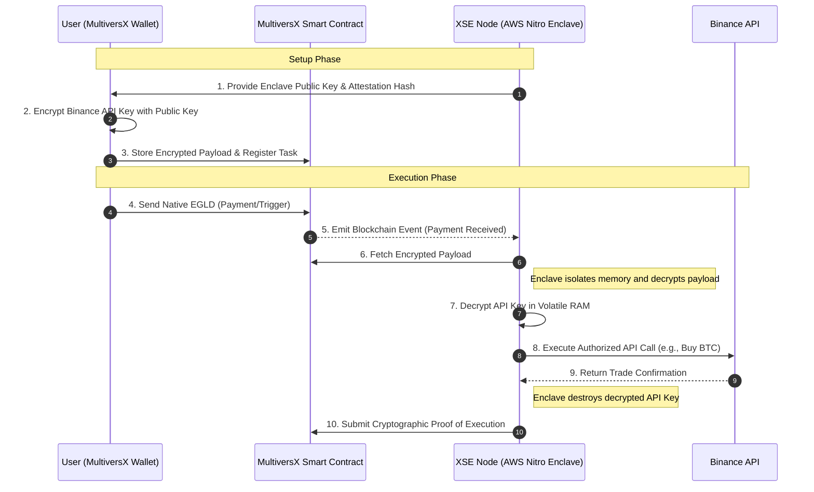

# 🏗️ XSE Protocol Architecture

The **XCron Sovereign Enclaves (XSE)** architecture operates as a hybrid on-chain/off-chain relayer. It bridges the deterministic environment of the MultiversX blockchain with the centralized environments of Web2 exchanges (like Binance), while maintaining zero-knowledge custody of sensitive credentials.

## System Flow

The following Mermaid diagram illustrates the execution flow of an automated action (e.g., executing a trade on Binance after a MultiversX payment is confirmed).

## Component Breakdown

1.  **MultiversX Smart Contract:** Acts as the decentralized registry and escrow. It holds the encrypted user payload and waits for triggers (like time-based crons or incoming transactions).
2.  **XSE Node (The Enclave):** A highly restricted, hardware-isolated virtual machine running a compiled Rust binary. It has no persistent storage, no SSH access, and limited external network access (only to whitelisted APIs).
3.  **Client-Side Encryption:** Users encrypt their sensitive data locally using standard asymmetric cryptography (e.g., RSA-4096 or ECIES) before it ever touches the blockchain or the internet.
